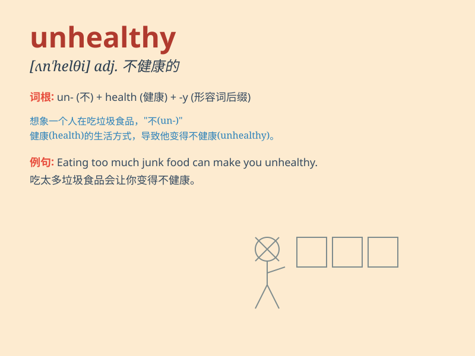

## unhealthy

**英音:** _[ʌn\'helθɪ]_ **美音:** _[ʌn\'hɛlθi]_

**译义:** *adj.不健康的,对健康有害的*

### 短语

+ **unhealthy diet:** _不健康的饮食_

+ **unhealthy lifestyle:** _不健康的生活方式_

+ **unhealthy competition:** _不正当竞争_

+ **unhealthy habit:** _不良习惯_

+ **unhealthy environment:** _不健康的环境_

### 例句

#### 例句1

> **Eating too much junk food is an unhealthy habit.**

**中文翻译:** 吃太多垃圾食品是一种不健康的习惯。

**单词释义:** 不健康的

#### 例句2

> **The air in this city is unhealthy due to heavy pollution.**

**中文翻译:** 由于严重的污染，这个城市的空气不健康。

**单词释义:** 不健康的

#### 例句3

> **He has an unhealthy lifestyle and rarely exercises.**

**中文翻译:** 他有一种不健康的生活方式，很少锻炼。

**单词释义:** 不健康的

### 背诵小故事

> A little boy named Tom always ate junk food and never exercised. As a
result, he often got sick. We can say Tom\'s lifestyle was unhealthy. He
needed to change to be healthy.

**一个叫汤姆的小男孩总是吃垃圾食品而且从不锻炼。结果，他经常生病。我们可以说汤姆的生活方式是不健康的。他需要改变才能变得健康。**

### 图义

