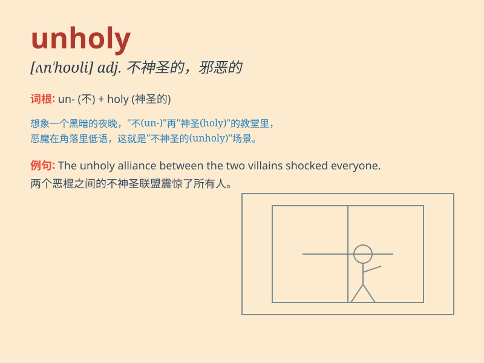

## unholy

**英音:** _[ʌn\'həʊlɪ]_ **美音:** _[ʌn\'holi]_

**译义:** *adj.不神圣的,不洁净的,邪恶的,不合理的*

### 短语

+ **unholy alliance:** _邪恶的联盟_

+ **unholy mess:** _混乱不堪_

+ **unholy terror:** _极度恐惧_

+ **unholy speed:** _惊人的速度_

+ **unholy combination:** _不恰当的组合_

### 例句

#### 例句1

> **The unholy alliance between the two criminal gangs caused chaos
in the city.**

**中文翻译:** 这两个犯罪团伙之间邪恶的联盟在城市里造成了混乱。

**单词释义:** 邪恶的；不神圣的

#### 例句2

> **The unholy smell coming from the abandoned house made us hold our
breaths.**

**中文翻译:** 从那所废弃的房子里传来的难闻气味让我们屏住了呼吸。

**单词释义:** 令人厌恶的；不洁的

#### 例句3

> **They engaged in unholy practices that were condemned by the
community.**

**中文翻译:** 他们从事了被社区谴责的不道德行为。

**单词释义:** 不道德的；亵渎神明的

### 背诵小故事

> In a dark forest, there was an unholy place. A witch lived there,
performing evil spells. Everyone was afraid to go near. It was a place
full of dark and terrifying magic.

**在一片黑暗的森林里，有一个邪恶的地方。一个女巫住在那里，施展着邪恶的法术。每个人都害怕靠近。那是一个充满黑暗和恐怖魔法的地方。**

### 图义

