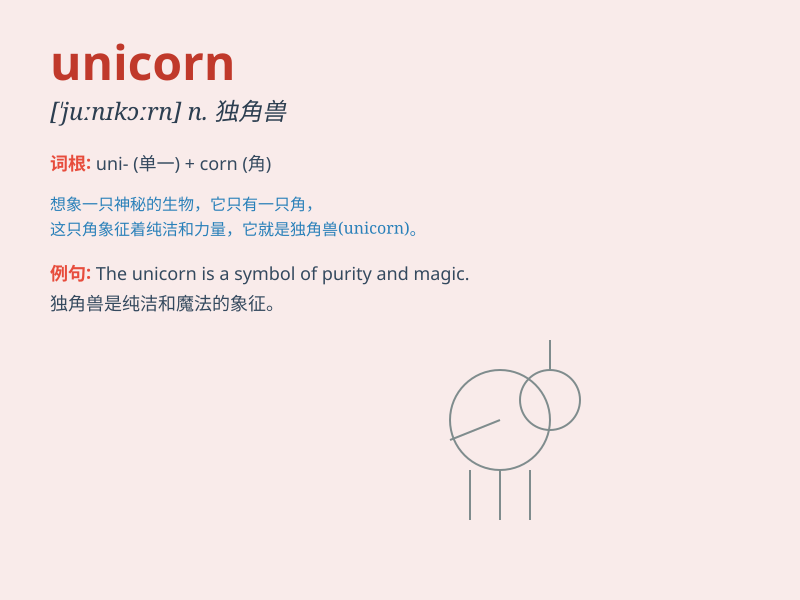

## unicorn

**英音:** _[\'juːnɪkɔːn]_ **美音:** _[\'junɪkɔrn]_

**译义:** *n.独角兽,麒麟*

### 短语

+ **unicorn horn:** _独角兽的角_

+ **unicorn company:** _独角兽公司（指估值超过 10
亿美元的初创公司）_

+ **mythical unicorn:** _神话中的独角兽_

+ **enchanted unicorn:** _被施了魔法的独角兽_

+ **imaginary unicorn:** _想象中的独角兽_

### 例句

#### 例句1

> **The little girl dreamed of riding a unicorn.**

**中文翻译:** 这个小女孩梦想着骑上一只独角兽。

**单词释义:** 独角兽

#### 例句2

> **In the fantasy world, unicorns are considered magical
creatures.**

**中文翻译:** 在幻想世界里，独角兽被认为是神奇的生物。

**单词释义:** 独角兽

#### 例句3

> **She wore a necklace with a unicorn pendant.**

**中文翻译:** 她戴着一条带有独角兽吊坠的项链。

**单词释义:** 独角兽

### 背诵小故事

> A little girl was lost in a forest. Suddenly, a unicorn appeared and
guided her home. The unicorn had a single horn on its head and was very
magical. It was a wonderful encounter.

**一个小女孩在森林里迷路了。突然，一只独角兽出现并引导她回家。这只独角兽头上有一只角，非常神奇。这是一次奇妙的相遇。**

### 图义

