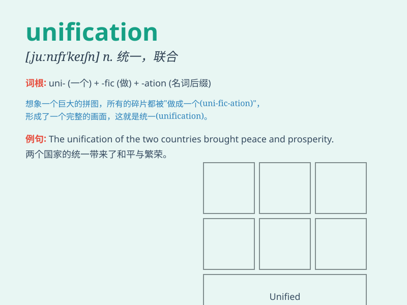

## unification

**英音:** _[,juːnɪfɪ\'keɪʃ(ə)n]_ **美音:**
_[,jʊnəfə\'keʃən]_

**译义:** *n.统一,合一,一致*

### 短语

+ **political unification:** _政治统一_

+ **national unification:** _国家统一_

+ **territorial unification:** _领土统一_

+ **economic unification:** _经济统一_

+ **cultural unification:** _文化统一_

### 例句

#### 例句1

> **The unification of the two companies was a complex process.**

**中文翻译:** 这两家公司的统一是一个复杂的过程。

**单词释义:** 统一；联合

#### 例句2

> **The unification of Germany in 1990 was a significant event in
European history.**

**中文翻译:** 1990 年德国的统一是欧洲历史上的一个重大事件。

**单词释义:** 统一

#### 例句3

> **The goal of the peace talks is the unification of the
country.**

**中文翻译:** 和平谈判的目标是国家的统一。

**单词释义:** 统一

### 背诵小故事

> Once upon a time, there were many small kingdoms. But a wise leader
worked hard to bring them together. This process was called
\'unification\'. It means making separate things become one whole.

**从前，有许多小王国。但一位睿智的领袖努力将它们聚集在一起。这个过程被称为"统一"。它意味着使分离的事物成为一个整体。**

### 图义

