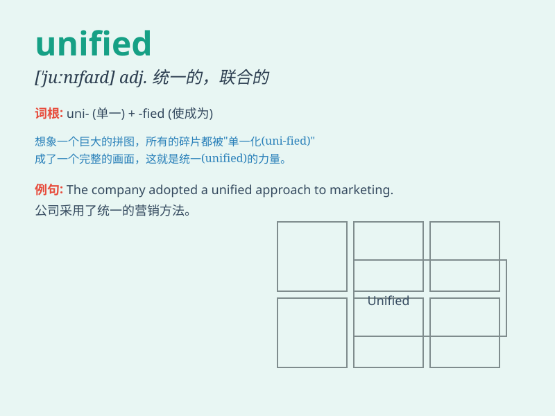

## unified

**英音:** _[ˈjuːnɪfaɪd]_ **美音:** _[ˈjunɪfaɪd]_

**译义:** *adj.统一的；一致的；合并的*

### 短语

+ **unified theory:** _统一理论_

+ **unified standard:** _统一标准_

+ **unified system:** _统一系统_

+ **unified approach:** _统一方法_

+ **unified management:** _统一管理_

### 例句

#### 例句1

> **The company has a unified management system.**

**中文翻译:** 这家公司有一个统一的管理系统。

**单词释义:** 统一的

#### 例句2

> **They are working towards a unified goal.**

**中文翻译:** 他们正在朝着一个统一的目标努力。

**单词释义:** 统一的

#### 例句3

> **The unified team performed well in the competition.**

**中文翻译:** 统一的团队在比赛中表现出色。

**单词释义:** 统一的

### 背诵小故事

> Once upon a time, there were many small kingdoms. But a wise leader
came and made them into one. They became unified, meaning brought
together as a whole. Everyone worked together for a better future.

**从前，有许多小王国。但一位睿智的领袖出现，将它们变成了一个。它们变得统一了，意思是作为一个整体聚集在一起。每个人都为更美好的未来共同努力。**

### 图义

