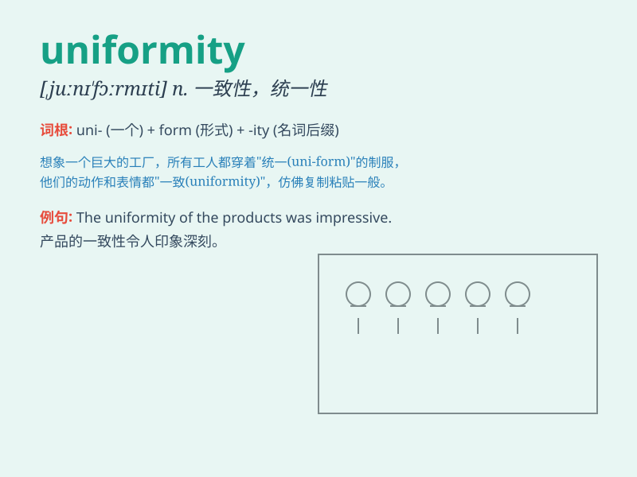

## uniformity

**英音:** _[juːnɪ\'fɔːmɪtɪ]_ **美音:**
_[,jʊnə\'fɔrməti]_

**译义:** *n.同样,一式,一致,均匀*

### 短语

+ **uniformity of temperature:** _温度的均匀性_

+ **uniformity of color:** _颜色的一致性_

+ **uniformity of texture:** _质地的均匀性_

+ **uniformity of distribution:** _分布的均匀性_

+ **uniformity of performance:** _性能的一致性_

### 例句

#### 例句1

> **The uniformity of the products is crucial for our brand
reputation.**

**中文翻译:** 产品的一致性对我们的品牌声誉至关重要。

**单词释义:** 一致性；整齐性

#### 例句2

> **There is a lack of uniformity in the application of these
rules.**

**中文翻译:** 这些规则的应用缺乏一致性。

**单词释义:** 一致性；统一性

#### 例句3

> **The uniformity of the paint color gives the room a sleek
look.**

**中文翻译:** 油漆颜色的均匀性使房间看起来很光滑。

**单词释义:** 均匀性；均等

### 背诵小故事

> A group of soldiers was preparing for a parade. They all wore the
same style and color of uniform, showing perfect uniformity. This scene
made people feel their unity and discipline.

**一群士兵正在为阅兵做准备。他们都穿着相同款式和颜色的制服，展现出了完美的一致性。这个场景让人感受到了他们的团结和纪律。**

### 图义

