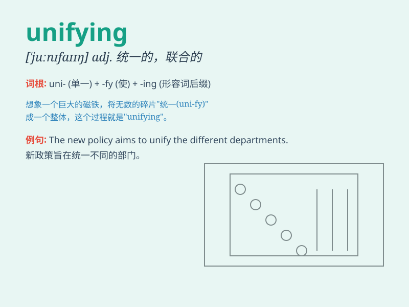

## unifying

**英音:** _[ˈjuː.naɪ.f.aɪ.ɪŋ]_ **美音:**
_[ˈjuː.naɪ.f.aɪ.ɪŋ]_

**译义:** *adj.统一的；使一致的（unify的现在分词形式）*

### 短语

+ **unifying force:** _统一的力量_

+ **unifying principle:** _统一原则_

+ **unifying theory:** _统一理论_

+ **unifying element:** _统一元素_

+ **unifying concept:** _统一概念_

### 例句

#### 例句1

> **The unifying theme of the conference was environmental
protection.**

**中文翻译:** 这次会议的统一主题是环境保护。

**单词释义:** 统一的

#### 例句2

> **Music has a unifying power that brings people together.**

**中文翻译:** 音乐有一种将人们聚集在一起的统一力量。

**单词释义:** 使统一的

#### 例句3

> **The unifying force of a common goal helped the team succeed.**

**中文翻译:** 共同目标的统一力量帮助这个团队取得了成功。

**单词释义:** 统一的

### 背诵小故事

> Once upon a time, there were many small kingdoms. A wise leader came
and started a unifying process. He brought everyone together, making the
land stronger and more peaceful. \'Unifying\' means to bring things or
people together as one.

**从前，有许多小王国。一位睿智的领袖出现并开始了统一的进程。他将所有人聚集在一起，使这片土地更强大、更和平。\'unifying\'意思是使事物或人合为一体。**

### 图义

