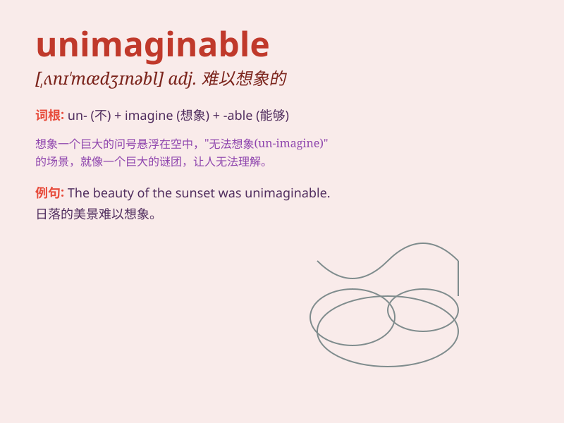

## unimaginable

**英音:** _[ʌnɪ\'mædʒɪnəb(ə)l]_ **美音:**
_[,ʌnɪ\'mædʒɪnəbl]_

**译义:** *adj.,想不到的,不可思议的*

### 短语

+ **unimaginable difficulty:** _难以想象的困难_

+ **unimaginable horror:** _难以想象的恐惧_

+ **unimaginable beauty:** _难以想象的美丽_

+ **unimaginable pain:** _难以想象的痛苦_

+ **unimaginable wealth:** _难以想象的财富_

### 例句

#### 例句1

> **The scale of the disaster was unimaginable.**

**中文翻译:** 这场灾难的规模是难以想象的。

**单词释义:** 难以想象的

#### 例句2

> **The wealth he accumulated is unimaginable.**

**中文翻译:** 他积累的财富是难以想象的。

**单词释义:** 难以想象的

#### 例句3

> **The pain she endured was unimaginable.**

**中文翻译:** 她所忍受的痛苦是难以想象的。

**单词释义:** 难以想象的

### 背诵小故事

> Once upon a time, a man found a treasure chest in a cave. But the
contents inside were so strange and complex that they were unimaginable.
No one could guess what they were.

**从前，有个人在一个洞穴里发现了一个宝箱。但里面的东西是如此的奇怪和复杂，简直难以想象。没有人能猜到它们是什么。**

### 图义

