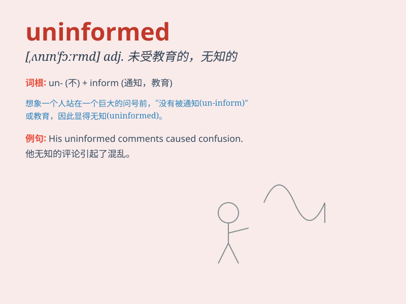

## uninformed

**英音:** _[ʌnɪn\'fɔːmd]_ **美音:** _[,ʌnɪn\'fɔrmd]_

**译义:** *adj.未被通知的,未获情报,无生气的*

### 短语

+ **uninformed decision:** _不明智的决定_

+ **uninformed opinion:** _无知的看法_

+ **remain uninformed:** _仍然不知情_

+ **uninformed source:** _不可靠的消息来源_

+ **uninformed guess:** _盲目的猜测_

### 例句

#### 例句1

> **The uninformed tourist got lost in the unfamiliar city.**

**中文翻译:** 这位消息不灵通的游客在这个陌生的城市迷路了。

**单词释义:** 消息不灵通的

#### 例句2

> **He made uninformed decisions that led to serious
consequences.**

**中文翻译:** 他做出了无知的决定，导致了严重的后果。

**单词释义:** 无知的

#### 例句3

> **The uninformed public was easily misled by false rumors.**

**中文翻译:** 不知情的公众很容易被虚假谣言误导。

**单词释义:** 不知情的

### 背诵小故事

> A tourist was lost in a strange city. He asked a local for
directions, but the local was uninformed and couldn\'t help. The tourist
felt frustrated as he needed accurate information to find his way.

**一位游客在一个陌生的城市迷路了。他向一位当地人问路，但这个当地人一无所知，无法帮忙。游客感到很沮丧，因为他需要准确的信息来找到路。**

### 图义

