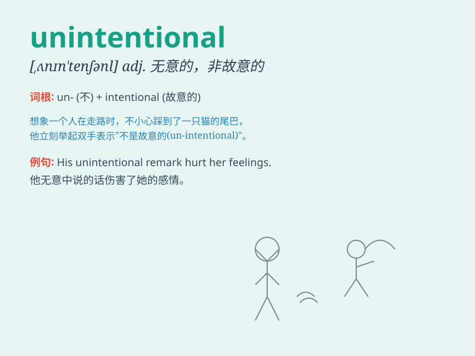

## unintentional

**英音:** _[ʌnɪn\'tenʃ(ə)n(ə)l]_ **美音:**
_[,ʌnɪn\'tɛnʃənl]_

**译义:** *adj.不是故意的,无心的,无意识的*

### 短语

+ **unintentional error:** _无意的错误_

+ **unintentional harm:** _无意的伤害_

+ **unintentional omission:** _无意的遗漏_

+ **unintentional act:** _无意的行为_

+ **unintentional consequence:** _无意的后果_

### 例句

#### 例句1

> **The damage was unintentional; he didn\'t mean to break the
vase.**

**中文翻译:** 这次损坏是无意的；他并非有意打碎花瓶。

**单词释义:** 无意的；非故意的

#### 例句2

> **Her unintentional mistake caused a lot of trouble.**

**中文翻译:** 她无意犯下的错误造成了很多麻烦。

**单词释义:** 无意的；不经意的

#### 例句3

> **The unintentional disclosure of the secret affected the
company\'s business.**

**中文翻译:** 秘密的无意泄露影响了公司的业务。

**单词释义:** 无意的；非存心的

### 背诵小故事

> One day, Tom accidentally broke a vase. But it was unintentional. He
didn\'t mean to do it. His mom understood and forgave him.

**一天，汤姆意外地打碎了一个花瓶。但这是无意的。他并非有意这么做。他的妈妈理解并原谅了他。**

### 图义

