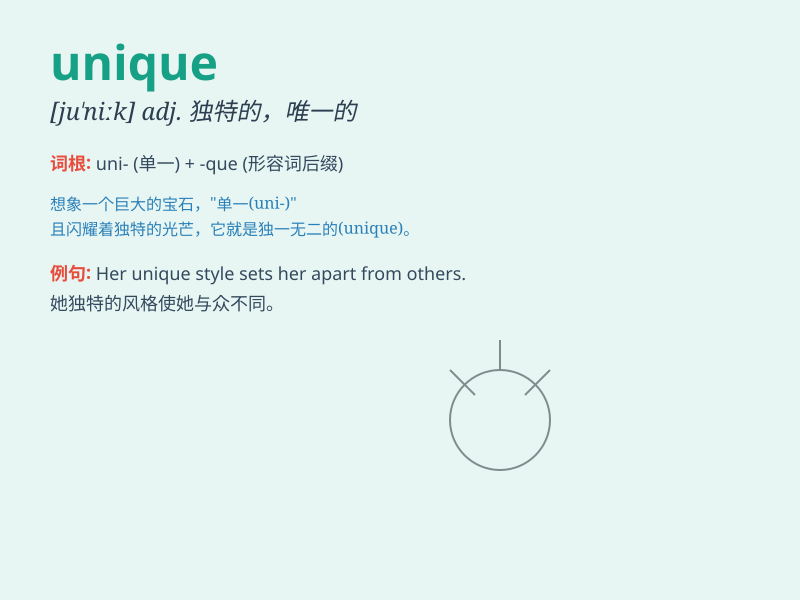

## unique

**英音:** _[juː\'niːk]_ **美音:** _[jʊ\'nik]_

**译义:** *adj.唯一的,独特的*

### 短语

+ **unique feature:** _独特的特征_

+ **unique opportunity:** _独特的机会_

+ **unique style:** _独特的风格_

+ **unique solution:** _独特的解决方案_

+ **unique selling point:** _独特的卖点_

### 例句

#### 例句1

> **This is a unique opportunity that should not be missed.**

**中文翻译:** 这是一个不应错过的独特机会。

**单词释义:** 独特的

#### 例句2

> **Each person has a unique personality.**

**中文翻译:** 每个人都有独特的个性。

**单词释义:** 独特的

#### 例句3

> **The design of this building is quite unique.**

**中文翻译:** 这座建筑的设计相当独特。

**单词释义:** 独特的

### 背诵小故事

> A prince was seeking a unique gem for his beloved princess. He
searched far and wide until he found one that no one else had. This gem
was truly unique, just like their love.

**一位王子为他心爱的公主寻找一颗独特的宝石。他四处寻觅，直到找到一颗无人拥有的宝石。这颗宝石真的很独特，就像他们的爱情一样。**

### 图义

