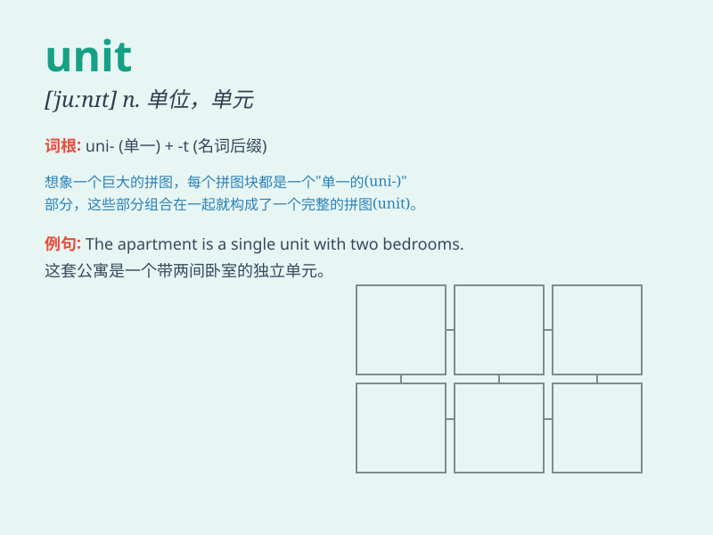

## unit

**英音:** _[\'juːnɪt]_ **美音:** _[\'junɪt]_

**译义:** *n.个体,(计量)单位,(军队的)部队单位,[数学]最小的整数*

### 短语

+ **unit price:** _单价_

+ **unit area:** _单位面积_

+ **processing unit:** _处理单元；加工单元_

+ **control unit:** _控制单元；控制器_

+ **measurement unit:** _测量单位_

### 例句

#### 例句1

> **The school has many teaching units.**

**中文翻译:** 这所学校有许多教学单位。

**单词释义:** 单位

#### 例句2

> **This machine is composed of several units.**

**中文翻译:** 这台机器由几个单元组成。

**单词释义:** 单元

#### 例句3

> **The army unit was sent to the front line.**

**中文翻译:** 这支军队单位被派往了前线。

**单词释义:** 部队；单位

### 背诵小故事

> 想象一下，在一个神秘的城堡里，每个房间都是一个独立的
unit（单元）。有卧室单元、厨房单元、书房单元等。它们虽独立，但共同构成了城堡这个整体。就像
unit 是构成整体的独立部分。

**想象在城堡中，每个房间作为独立的单元，以此来理解 unit
是构成整体的独立部分的意思**

### 图义

