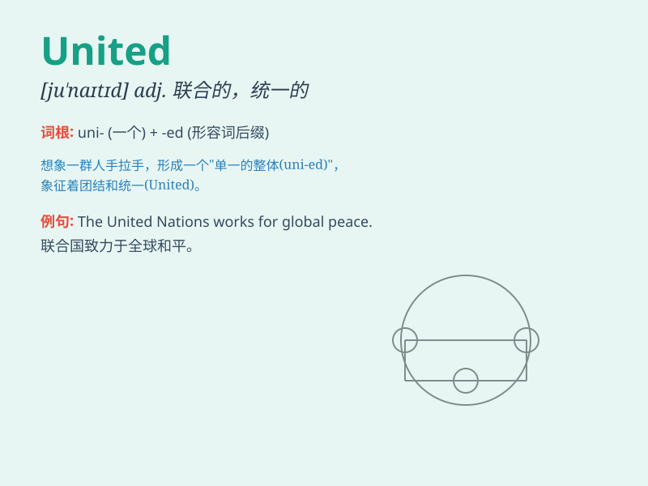

## United

**英音:** _[juːˈnaɪtɪd]_ **美音:** _[juˈnaɪtɪd]_

**译义:** *adj.联合的；统一的；和谐的；一致的；团结的*

### 短语

+ **United Nations:** _联合国_

+ **United States:** _美国；美利坚合众国_

+ **united front:** _统一战线；联合阵线_

+ **united effort:** _共同努力_

+ **united family:** _和睦的家庭；团结的家庭_

### 例句

#### 例句1

> **The United States is a powerful country.**

**中文翻译:** 美国是一个强大的国家。

**单词释义:** 联合的；统一的

#### 例句2

> **They are working towards a united goal.**

**中文翻译:** 他们正在为一个共同的目标而努力。

**单词释义:** 统一的；联合的

#### 例句3

> **The united team won the championship.**

**中文翻译:** 这支团结的队伍赢得了冠军。

**单词释义:** 团结的；联合的

### 背诵小故事

> Once upon a time, there were many small kingdoms. But they decided to
come together and form one big country. They were united and shared the
same goals. With unity, they became stronger and more prosperous.

**从前，有许多小王国。但他们决定联合起来组成一个大国家。他们团结在一起，有着相同的目标。通过团结，他们变得更强大、更繁荣。**

### 图义

