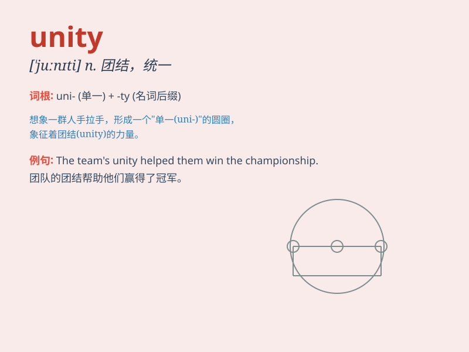

## unity

**英音:** _[ˈjuːnəti]_ **美音:** _[\'junəti]_

**译义:** *n.团结,联合,统一,一致*

### 短语

+ **national unity:** _国家统一_

+ **racial unity:** _种族团结_

+ **unity of purpose:** _目标一致_

+ **in unity:** _团结一致_

+ **promote unity:** _促进团结_

### 例句

#### 例句1

> **The country needs unity in the face of the economic crisis.**

**中文翻译:** 在面临经济危机时，这个国家需要团结一致。

**单词释义:** 团结一致；联合

#### 例句2

> **We should promote unity among all ethnic groups.**

**中文翻译:** 我们应该促进各民族之间的团结。

**单词释义:** 团结

#### 例句3

> **The theme of the conference is unity and cooperation.**

**中文翻译:** 这次会议的主题是团结与合作。

**单词释义:** 团结；统一

### 背诵小故事

> A group of friends were lost in a forest. They faced many
difficulties but worked together. Eventually, they found their way out.
This shows the power of unity. It means being together and working as
one.

**一群朋友在森林里迷路了。他们面临许多困难，但一起努力。最终，他们找到了出路。这展示了团结的力量。【unity】这个单词意为团结一致。**

### 图义

