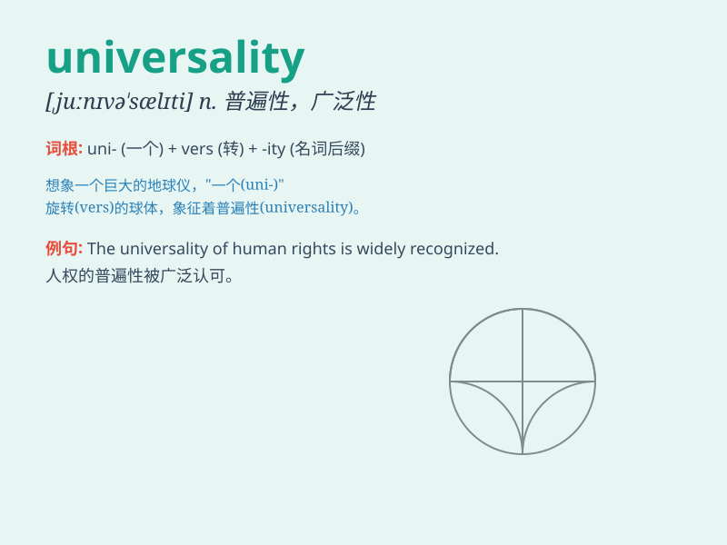

## universality

**英音:** _[,juːnɪvɜː\'sælətɪ]_ **美音:**
_[,jʊnəvɝ\'sæləti]_

**译义:** *n.普遍性,一般性,多方面性,广泛性*

### 短语

+ **universality of knowledge:** _知识的普遍性_

+ **universality principle:** _普遍性原则_

+ **claim universality:** _主张普遍性_

+ **lack of universality:** _缺乏普遍性_

+ **achieve universality:** _实现普遍性_

### 例句

#### 例句1

> **The universality of the Internet has changed the way we
communicate.**

**中文翻译:** 互联网的普遍性改变了我们交流的方式。

**单词释义:** 普遍性

#### 例句2

> **The principle of universality ensures equal treatment for
all.**

**中文翻译:** 普遍性原则确保了所有人的平等待遇。

**单词释义:** 普遍性

#### 例句3

> **We should strive for the universality of basic human rights.**

**中文翻译:** 我们应该为基本人权的普遍性而努力。

**单词释义:** 普遍性

### 背诵小故事

> In a magical world, all creatures sought the \'universality\' gem. It
held the power to unite everyone. Whoever found it would bring harmony
and understanding to all. With this gem, differences vanished, and a
universal connection was formed.

**在一个神奇的世界里，所有生物都在寻找"普遍性"宝石。它拥有团结所有人的力量。无论谁找到它，都会给所有人带来和谐与理解。有了这颗宝石，差异消失了，形成了一种普遍的联系。**

### 图义

