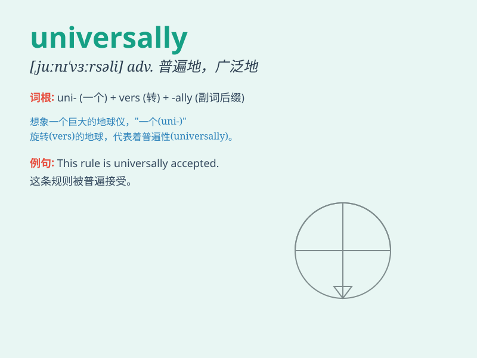

## universally

**英音:** _[juːnɪ\'vɜːsəlɪ]_ **美音:** _[,junɪ\'vɝsəli]_

**译义:** *adv.普遍地,全体地,到处*

### 短语

+ **universally recognized:** _被普遍认可_

+ **universally applicable:** _普遍适用_

+ **universally known:** _众所周知_

+ **universally accepted:** _被普遍接受_

+ **universally beloved:** _广受喜爱_

### 例句

#### 例句1

> **This principle is universally accepted.**

**中文翻译:** 这个原则被普遍接受。

**单词释义:** 普遍地

#### 例句2

> **The law is not universally applicable in all situations.**

**中文翻译:** 这条法律并非在所有情况下都普遍适用。

**单词释义:** 普遍地

#### 例句3

> **Universally, people strive for happiness and a better life.**

**中文翻译:** 普遍而言，人们都在为幸福和更好的生活而努力。

**单词释义:** 普遍地；全体地

### 背诵小故事

> In a magical land, everyone agreed that the flower was beautiful.
This agreement was universal. It meant universally, without any
exception. So, universally means accepted or true everywhere.

**在一个神奇的国度，每个人都认为那朵花很美。这种认同是普遍的。这意味着universally（普遍地），没有任何例外。所以，universally
意思是在各处都被接受或真实的。**

### 图义

