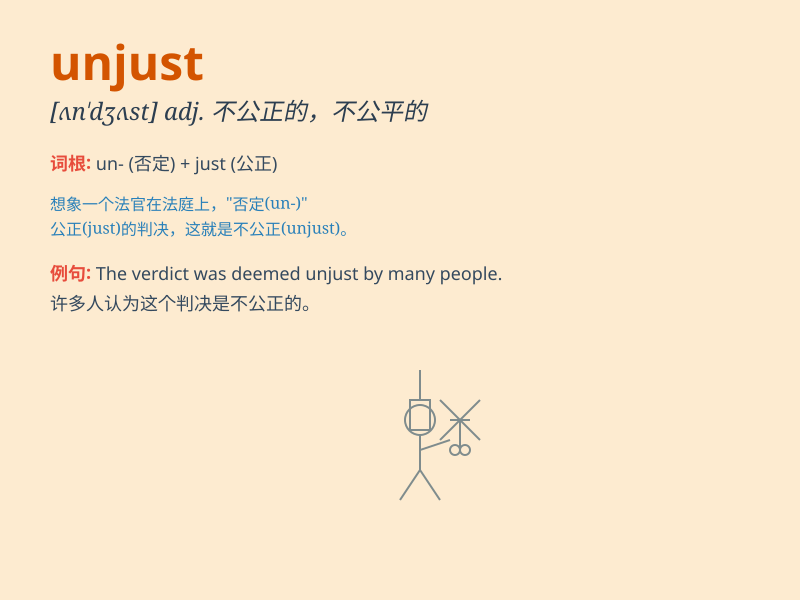

## unjust

**英音:** _[ʌn\'dʒʌst]_ **美音:** _[\'ʌn\'dʒʌst]_

**译义:** *adj.不公平的*

### 短语

+ **unjust treatment:** _不公正的待遇_

+ **unjust law:** _不公正的法律_

+ **unjust decision:** _不公正的决定_

+ **unjust accusation:** _不公正的指控_

+ **unjust system:** _不公正的制度_

### 例句

#### 例句1

> **The law was unjust and needed to be changed.**

**中文翻译:** 这项法律是不公正的，需要被修改。

**单词释义:** 不公正的

#### 例句2

> **He suffered an unjust punishment for a crime he didn\'t
commit.**

**中文翻译:** 他因一项他没有犯的罪行而遭受了不公正的惩罚。

**单词释义:** 不公正的

#### 例句3

> **It is unjust that some people have so much while others have so
little.**

**中文翻译:** 有些人拥有那么多而其他人拥有那么少，这是不公平的。

**单词释义:** 不公平的；不公正的

### 背诵小故事

> In a kingdom, the king\'s decisions were often unjust. He punished
the innocent and favored the rich. One brave citizen stood up and
exposed these unjust acts, making everyone realize the unfairness.

**在一个王国里，国王的决定常常是不公正的。他惩罚无辜者，偏袒富人。一位勇敢的公民站出来揭露了这些不公正的行为，让大家都意识到了不公平。**

### 图义

