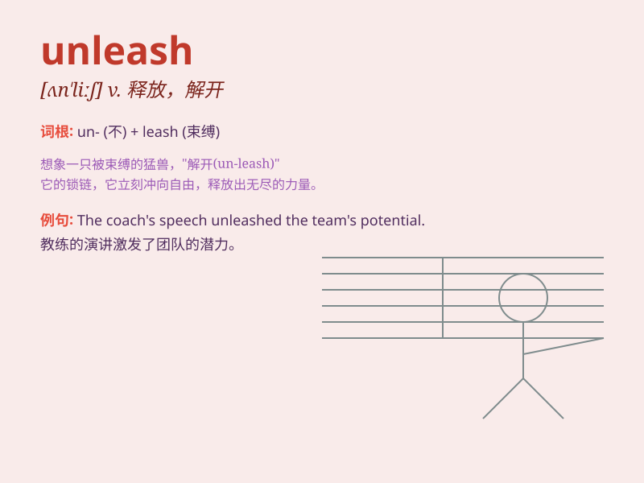

## unleash

**英音:** _[ʌn\'liːʃ]_ **美音:** _[ʌnˈliʃ]_

**译义:** *v.释放*

### 短语

+ **unleash potential:** _释放潜力_

+ **unleash power:** _释放力量_

+ **unleash anger:** _发泄愤怒_

+ **unleash creativity:** _激发创造力_

+ **unleash chaos:** _引发混乱_

### 例句

#### 例句1

> **The new technology could unleash a wave of innovation.**

**中文翻译:** 这项新技术可能会引发一波创新浪潮。

**单词释义:** 引发；释放

#### 例句2

> **He unleashed his anger on the poor dog.**

**中文翻译:** 他把怒气撒在那只可怜的狗身上。

**单词释义:** 发泄

#### 例句3

> **The storm unleashed its fury on the coastal town.**

**中文翻译:** 风暴在沿海城镇肆虐。

**单词释义:** 使（力量等）爆发

### 背诵小故事

> A brave warrior was trapped in a cage. One day, he found the key and
used it to unleash himself. He could finally fight freely for justice.
Remember, \'unleash\' means to set free or release something powerful.

**一位勇敢的战士被困在笼子里。有一天，他找到了钥匙并用它释放了自己。他终于能够自由地为正义而战。记住，\'unleash\'意思是释放、放开强大的东西。**

### 图义

