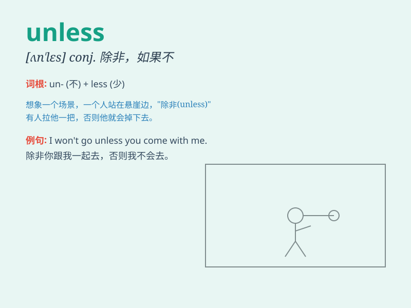

## unless

**英音:** _[ʌn\'les]_ **美音:** _[ən\'lɛs]_

**译义:** * conj.如果不,除非*

### 短语

+ **unless otherwise:** _除非另有_

+ **unless stated otherwise:** _除非另有说明_

+ **unless and until:** _直到...才_

+ **unless something intervenes:** _除非有事情干预_

+ **unless specified:** _除非特别指定_

### 例句

#### 例句1

> **I won\'t go to the party unless I\'m invited.**

**中文翻译:** 我不会去参加聚会，除非我被邀请。

**单词释义:** 除非，如果不

#### 例句2

> **You\'ll fail the exam unless you study hard.**

**中文翻译:** 你考试会不及格，除非你努力学习。

**单词释义:** 除非，如果不

#### 例句3

> **We can\'t leave unless the rain stops.**

**中文翻译:** 我们不能离开，除非雨停了。

**单词释义:** 除非，如果不

### 背诵小故事

> One day, a little boy wanted to play outside. His mom said he
couldn\'t go unless he finished his homework. So, the boy quickly did
his homework to enjoy the outside. \'Unless\' means except if.

**有一天，一个小男孩想出去玩。他妈妈说他不能出去，除非他完成作业。于是，男孩迅速完成作业去享受户外时光。'unless'意思是除非，如果不**

### 图义

