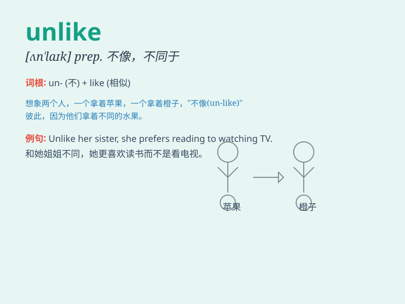

## unlike

**英音:** _[ʌn\'laɪk]_ **美音:** _[\'ʌn\'laɪk]_

**译义:** *adj.不同的,不相似的 prep.不象\...,和\...不同*

### 短语

+ **unlike anything:** _完全不同的东西_

+ **unlike before:** _不像以前_

+ **unlike most:** _与大多数不同_

+ **unlike others:** _与其他人不同_

+ **unlike her:** _不像她_

### 例句

#### 例句1

> **Unlike her sister, she is very quiet.**

**中文翻译:** 不像她姐姐，她非常安静。

**单词释义:** 不像；与\...\...不同

#### 例句2

> **It\'s unlike him to be late; he\'s usually very punctual.**

**中文翻译:** 他迟到可不像他的作风；他通常很准时。

**单词释义:** 不像；不符合\...\...的特点

#### 例句3

> **Unlike most people, I don\'t like coffee.**

**中文翻译:** 和大多数人不同，我不喜欢咖啡。

**单词释义:** 与\...\...不同；不像

### 背诵小故事

> Once upon a time, there were two apples. One was red and shiny, the
other was green and small. The red one was like all the other beautiful
apples, but the green one was unlike them. It was special in its own
way.

**从前，有两个苹果。一个又红又亮，另一个又绿又小。红苹果和其他漂亮的苹果相似，但绿苹果和它们不同。它有自己独特的地方。**

### 图义

