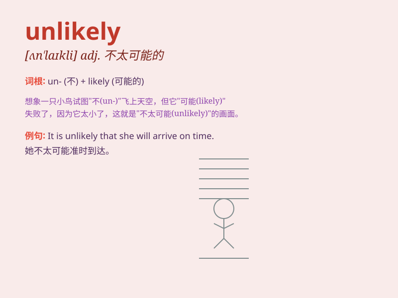

## unlikely

**英音:** _[ʌn\'laɪklɪ]_ **美音:** _[ʌn\'laɪkli]_

**译义:** *adj.未必的,不太可能的,靠不住的*

### 短语

+ **be unlikely to:** _不太可能_

+ **unlikely event:** _不太可能发生的事件_

+ **unlikely candidate:** _不太可能的候选人_

+ **unlikely story:** _难以置信的故事_

+ **seem unlikely:** _似乎不太可能_

### 例句

#### 例句1

> **It\'s unlikely that he will come today.**

**中文翻译:** 他今天不太可能来。

**单词释义:** 不大可能的

#### 例句2

> **The project seems unlikely to succeed without more
investment.**

**中文翻译:** 没有更多的投资，这个项目似乎不太可能成功。

**单词释义:** 不大可能的

#### 例句3

> **She is an unlikely candidate for the position.**

**中文翻译:** 她不太可能是这个职位的候选人。

**单词释义:** 不大可能的

### 背诵小故事

> A brave knight set out on a quest. Everyone thought it was unlikely
he would succeed as the journey was full of dangers. But with his
determination, he proved them wrong. \'Unlikely\' means not likely to
happen or be true.

**一位勇敢的骑士踏上了征程。大家都认为他不太可能成功，因为旅途充满危险。但凭借他的决心，他证明了大家是错的。'unlikely'意思是不大可能发生或真实的。**

### 图义

