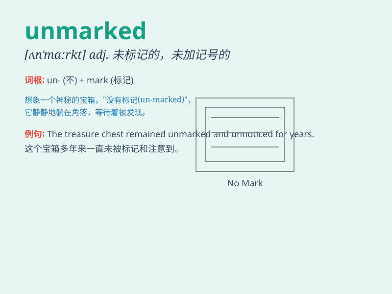

## unmarked

**英音:** _[ʌn\'mɑːkt]_ **美音:** _[ʌn\'mɑrkt]_

**译义:** *adj.未被注意的,无记号的*

### 短语

+ **unmarked car:** _未做标记的汽车_

+ **unmarked path:** _未标记的路径_

+ **unmarked package:** _未作标记的包裹_

+ **unmarked grave:** _没有标记的坟墓_

+ **unmarked spot:** _未标明的地点_

### 例句

#### 例句1

> **The unmarked package was left on the doorstep.**

**中文翻译:** 那个没有标记的包裹被留在了门阶上。

**单词释义:** 未做标记的；无记号的

#### 例句2

> **The unmarked path led deep into the forest.**

**中文翻译:** 这条未标明的小路通向森林深处。

**单词释义:** 未标明的；未被注意到的

#### 例句3

> **His grave remained unmarked for many years.**

**中文翻译:** 他的坟墓多年来一直没有标记。

**单词释义:** 无标记的；未加记号的

### 背诵小故事

> One day, I was in a forest and saw many trees. Some had marks on
them, but others were unmarked. It was easy to notice the difference.
The unmarked trees looked so plain and normal.

**有一天，我在森林里看到很多树。有些树上有标记，但另一些是没有标记的。很容易注意到这种差别。没有标记的树看起来如此普通和平凡。**

### 图义

