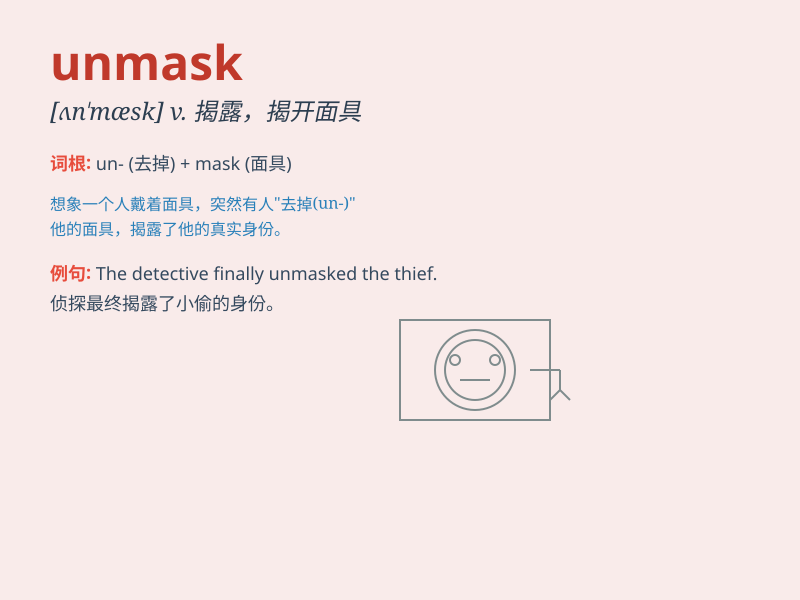

## unmask

**英音:** _[ʌn\'mɑːsk]_ **美音:** _[,ʌn\'mæsk]_

**译义:** *vi.脱去假面具vt.撕下\...的假面具,揭露,暴露*

### 短语

+ **unmask a fraud:** _揭露一个骗局_

+ **unmask the truth:** _揭示真相_

+ **unmask a spy:** _揭露一个间谍_

+ **unmask the culprit:** _揭露罪犯_

+ **unmask a conspiracy:** _揭露阴谋_

### 例句

#### 例句1

> **The detective was determined to unmask the criminal\'s true
identity.**

**中文翻译:** 这位侦探决心揭露罪犯的真实身份。

**单词释义:** 揭露，揭开

#### 例句2

> **The investigation aims to unmask the corruption within the
organization.**

**中文翻译:** 这次调查旨在揭露该组织内部的腐败现象。

**单词释义:** 揭露，使暴露

#### 例句3

> **She managed to unmask his deception.**

**中文翻译:** 她设法揭穿了他的骗局。

**单词释义:** 揭穿，识破

### 背诵小故事

> In a mysterious castle, a villain wore a mask to hide his true
identity. But a brave detective was determined to unmask him. Finally,
the detective exposed the villain\'s face and revealed the truth.

**在一座神秘的城堡里，一个坏蛋戴着面具隐藏他的真实身份。但一位勇敢的侦探决心揭开他的面具。最终，侦探揭露了坏蛋的面容，揭示了真相。**

### 图义

