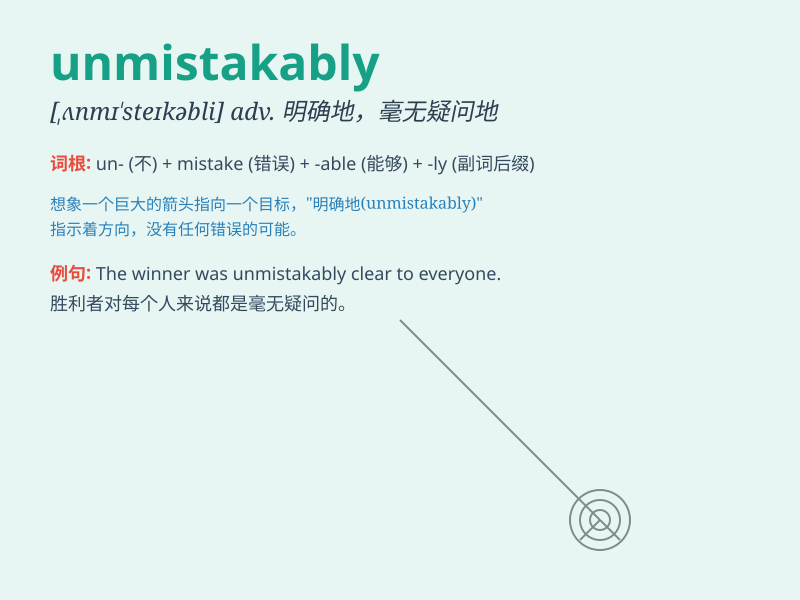

## unmistakably

**英音:** _[ˌʌnmɪ\'steɪkəbli]_ **美音:**
_[ˌʌnmɪ\'steɪkəbli]_

**译义:** *adv.明白地*

### 短语

+ **unmistakably clear:** _毫无疑问地清晰_

+ **unmistakably true:** _毫无疑问地真实_

+ **unmistakably obvious:** _毫无疑问地明显_

+ **unmistakably different:** _毫无疑问地不同_

+ **unmistakably beautiful:** _毫无疑问地美丽_

### 例句

#### 例句1

> **Her love for him was unmistakably evident in her every
gesture.**

**中文翻译:** 她对他的爱从她的每个姿态中都毫无疑问地明显表现出来。

**单词释义:** 毫无疑问地；明显地

#### 例句2

> **The handwriting on the note was unmistakably his.**

**中文翻译:** 纸条上的笔迹毫无疑问是他的。

**单词释义:** 毫无疑问地；明确地

#### 例句3

> **The sound of the explosion was unmistakably loud.**

**中文翻译:** 爆炸的声音毫无疑问是巨大的。

**单词释义:** 毫无疑问地；肯定地

### 背诵小故事

> A detective was looking for a criminal. Every clue pointed
unmistakably to one person. It was so clear that there was no mistake.
The detective caught the criminal easily.

**一位侦探正在寻找罪犯。每个线索都毫无疑问地指向一个人。这非常明确，没有错误。侦探轻松地抓住了罪犯。**

### 图义

