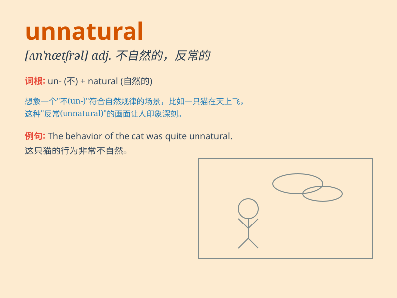

## unnatural

**英音:** _[ʌn\'nætʃ(ə)r(ə)l]_ **美音:** _[ʌn\'nætʃrəl]_

**译义:** *adj.不自然的*

### 短语

+ **unnatural death:** _非正常死亡_

+ **unnatural behavior:** _反常行为_

+ **unnatural smile:** _不自然的微笑_

+ **unnatural color:** _不自然的颜色_

+ **unnatural sound:** _不自然的声音_

### 例句

#### 例句1

> **The way she smiled seemed unnatural.**

**中文翻译:** 她笑的方式看起来不自然。

**单词释义:** 不自然的

#### 例句2

> **His unnatural behavior raised suspicion.**

**中文翻译:** 他不自然的行为引起了怀疑。

**单词释义:** 不自然的

#### 例句3

> **The color of the flower was so unnatural that it looked
artificial.**

**中文翻译:** 这朵花的颜色太不自然了，看起来像是人造的。

**单词释义:** 不自然的；人造的

### 背诵小故事

> A scientist was conducting experiments to create artificial life. The
results were unnatural, like creatures with strange features. People
were shocked and feared these abnormal creations. This shows what
\'unnatural\' means - not normal or not in accordance with nature.

**一位科学家正在进行实验以创造人造生命。结果是不自然的，比如有着奇怪特征的生物。人们感到震惊并害怕这些反常的创造物。这展示了'unnatural'的意思------不正常的或不符合自然规律的。**

### 图义

