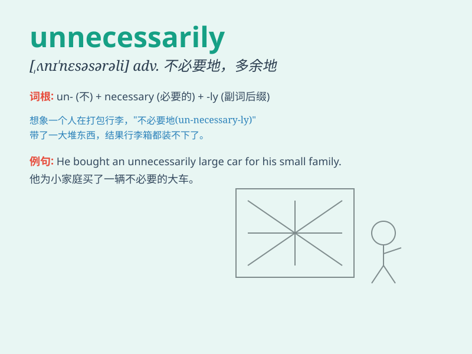

## unnecessarily

**英音:** _[ˌʌn\'nesəsərəli]_ **美音:**
_[ˌʌn\'nesəsərəli]_

**译义:** *adv.不必要地,未必*

### 短语

+ **unnecessarily complicated:** _不必要地复杂_

+ **unnecessarily harsh:** _不必要地严厉_

+ **unnecessarily long:** _不必要地长_

+ **unnecessarily expensive:** _不必要地昂贵_

+ **unnecessarily risky:** _不必要地冒险_

### 例句

#### 例句1

> **He was unnecessarily worried about the exam results.**

**中文翻译:** 他对考试结果不必要地担心。

**单词释义:** 不必要地

#### 例句2

> **The meeting lasted unnecessarily long.**

**中文翻译:** 会议持续了不必要的长时间。

**单词释义:** 不必要地

#### 例句3

> **She spent unnecessarily much money on clothes.**

**中文翻译:** 她在衣服上花了不必要的很多钱。

**单词释义:** 不必要地

### 背诵小故事

> One day, Tom was criticized for doing something unnecessarily. He
bought an expensive pen just to show off, but it was not needed at all.
This made him realize that he shouldn\'t act unnecessarily in the
future.

**一天，汤姆因做了一些不必要的事而受到批评。他买了一支昂贵的笔只是为了炫耀，但这完全没有必要。这让他意识到以后不应该做不必要的事。**

### 图义

