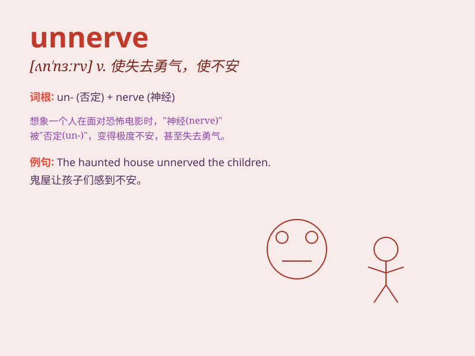

## unnerve

**英音:** _[ʌn\'nɜːv]_ **美音:** _[,ʌn\'nɝv]_

**译义:** *vt.使失去勇气,使身心交疲,使失常*

### 短语

+ **be unnerved:** _感到不安；失去勇气_

+ **unnerve someone:** _使某人失去勇气；使某人不安_

+ **completely unnerved:** _完全失去勇气；完全不安_

+ **slightly unnerved:** _稍微感到不安；稍微失去勇气_

+ **unnerve at something:** _因某事而感到不安或失去勇气_

### 例句

#### 例句1

> **The constant criticism unnerved him and affected his performance
at work.**

**中文翻译:** 持续的批评使他感到不安，影响了他在工作中的表现。

**单词释义:** 使不安；使失去信心

#### 例句2

> **The horror movie unnerved her so much that she couldn\'t sleep at
night.**

**中文翻译:** 这部恐怖电影让她非常不安，以至于她晚上无法入睡。

**单词释义:** 使胆怯；使害怕

#### 例句3

> **The unexpected news unnerved the entire team before the important
game.**

**中文翻译:** 在重要比赛前，这个意外的消息让整个团队感到不安。

**单词释义:** 使焦虑；使紧张

### 背诵小故事

> A brave knight was about to enter a dark cave. Suddenly, a strange
sound unnerve him. His hands trembled and his heart raced. It made him
lose his courage and confidence.

**一位勇敢的骑士正要进入一个黑暗的洞穴。突然，一阵奇怪的声音使他感到不安。他的手颤抖起来，心跳加速。这让他失去了勇气和信心。**

### 图义

