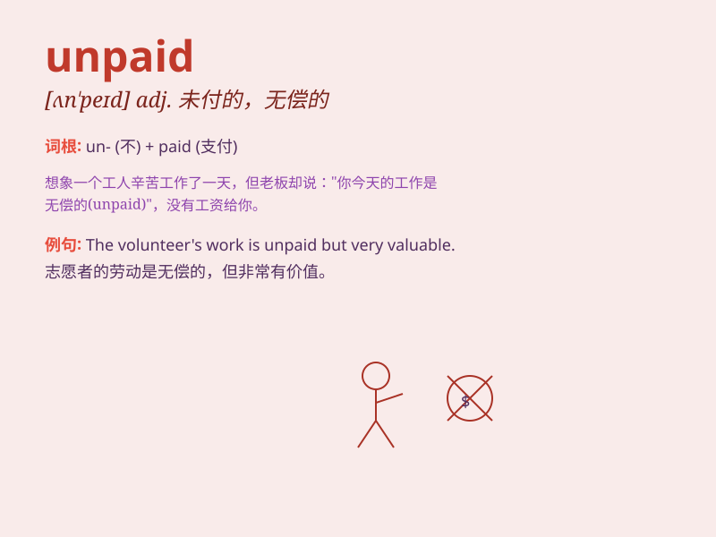

## unpaid

**英音:** _[ʌn\'peɪd]_ **美音:** _[,ʌn\'ped]_

**译义:** *adj.未付款的,不受报酬的*

### 短语

+ **unpaid bill:** _未付的账单_

+ **unpaid leave:** _无薪假_

+ **unpaid work:** _无偿工作_

+ **unpaid debt:** _未偿债务_

+ **unpaid balance:** _未付余额_

### 例句

#### 例句1

> **He took on an unpaid internship to gain work experience.**

**中文翻译:** 他接受了一份无薪实习来获取工作经验。

**单词释义:** 无薪的

#### 例句2

> **The unpaid bills piled up on his desk.**

**中文翻译:** 未付的账单在他的桌子上堆积起来。

**单词释义:** 未支付的

#### 例句3

> **She dedicated her time to unpaid community service.**

**中文翻译:** 她把时间奉献给了无偿的社区服务。

**单词释义:** 无偿的

### 背诵小故事

> A hardworking artist spent months creating beautiful paintings, but
was left unpaid. The artist felt sad and frustrated. Remember,
\'unpaid\' means not having received payment.

**一位勤奋的艺术家花了几个月创作了精美的画作，但却没有得到报酬。艺术家感到悲伤和沮丧。记住，\'unpaid\'意思是未支付的、未偿付的。**

### 图义

