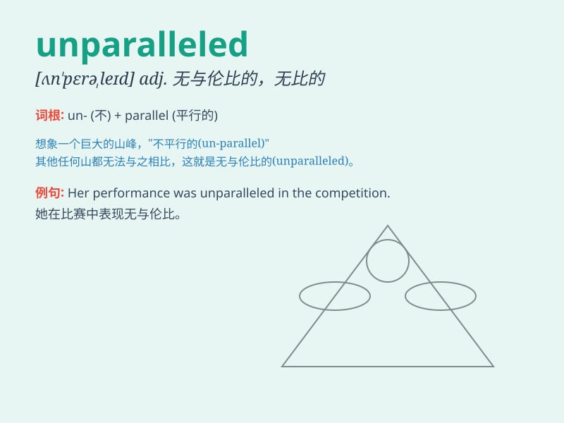

## unparalleled

**英音:** _[ʌn\'pærəleld]_ **美音:** _[ʌn\'pærəlɛld]_

**译义:** *adj.无比的,无双的,空前的*

### 短语

+ **unparalleled achievement:** _无与伦比的成就_

+ **unparalleled beauty:** _绝世之美_

+ **unparalleled skill:** _无双的技艺_

+ **unparalleled opportunity:** _空前的机会_

+ **unparalleled growth:** _前所未有的增长_

### 例句

#### 例句1

> **The technology company achieved an unparalleled success in the
market.**

**中文翻译:** 这家科技公司在市场上取得了无与伦比的成功。

**单词释义:** 无与伦比的；空前的

#### 例句2

> **Her beauty is unparalleled among her peers.**

**中文翻译:** 她的美丽在同龄人中是无可比拟的。

**单词释义:** 无可比拟的

#### 例句3

> **The athlete\'s performance this season was unparalleled in the
history of the sport.**

**中文翻译:** 这位运动员本赛季的表现是这项运动历史上空前的。

**单词释义:** 空前的

### 背诵小故事

> Once upon a time, a young artist created a painting that was
unparalleled. No other works could match its beauty and uniqueness. It
was so special that it stood out among all. Just like this,
\'unparalleled\' means having no equal; unique.

**从前，有一位年轻的艺术家创作了一幅无与伦比的画。没有其他作品能与之媲美，它是如此特别，在所有作品中脱颖而出。就像这样，'unparalleled'意思是无可匹敌的；独特的。**

### 图义

