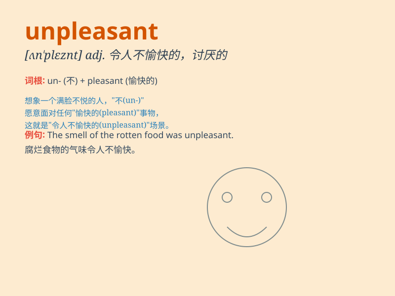

## unpleasant

**英音:** _[ʌn\'plez(ə)nt]_ **美音:** _[ʌn\'plɛznt]_

**译义:** *adj.使人不愉快的,讨厌的*

### 短语

+ **unpleasant experience:** _不愉快的经历_

+ **unpleasant smell:** _难闻的气味_

+ **unpleasant surprise:** _令人不快的意外_

+ **unpleasant task:** _讨厌的任务_

+ **unpleasant memory:** _不愉快的回忆_

### 例句

#### 例句1

> **The smell in the room was unpleasant.**

**中文翻译:** 房间里的气味令人不快。

**单词释义:** 令人不快的；讨厌的

#### 例句2

> **She had an unpleasant experience at the party.**

**中文翻译:** 她在聚会上有一次不愉快的经历。

**单词释义:** 不愉快的；讨厌的

#### 例句3

> **The weather was unpleasant, so we stayed at home.**

**中文翻译:** 天气令人不适，所以我们待在家里。

**单词释义:** 令人不适的；讨厌的

### 背诵小故事

> One day, I had an unpleasant experience. I went to a park but it was
crowded and noisy. The weather was bad, too. It made me feel really
uncomfortable and unhappy.

**有一天，我有了一次不愉快的经历。我去了一个公园，但那里又拥挤又嘈杂。天气也很糟糕。这让我感到非常不舒服和不开心。**

### 图义

