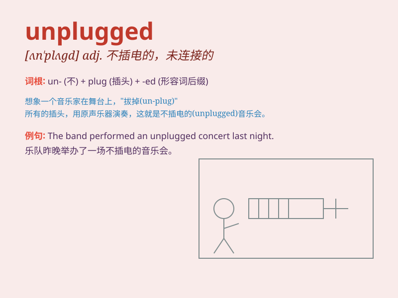

## unplugged

**英音:** _[ˌʌnˈplʌɡd]_ **美音:** _[ˌʌnˈplʌɡd]_

**译义:** *adj. 未插电的；不使用电子乐器的*

### 短语

+ **unplugged concert:** _不插电音乐会_

+ **unplugged version:** _不插电版本_

+ **unplugged performance:** _不插电表演_

+ **stay unplugged:** _保持不插电状态_

+ **unplugged music:** _不插电音乐_

### 例句

#### 例句1

> **The musician performed an unplugged version of his popular
song.**

**中文翻译:** 这位音乐家表演了他那首流行歌曲的不插电版本。

**单词释义:** 不插电的（指音乐表演不用电子乐器，只用原声乐器）

#### 例句2

> **I spent a relaxing evening enjoying unplugged music.**

**中文翻译:** 我度过了一个放松的夜晚，享受着不插电音乐。

**单词释义:** 不插电的（指音乐）

#### 例句3

> **The unplugged concert attracted a large audience.**

**中文翻译:** 这场不插电音乐会吸引了大量观众。

**单词释义:** 不插电的（形容音乐会）

### 背诵小故事

> One day, Tom was at a concert. The band played unplugged music. It
meant they didn\'t use electric guitars or amps. Just simple acoustic
instruments. Tom loved the pure and natural sound.

**有一天，汤姆在一场音乐会。乐队演奏不插电音乐。这意味着他们不使用电吉他或扩音器。只用简单的原声乐器。汤姆喜欢这种纯净自然的声音。**

### 图义

