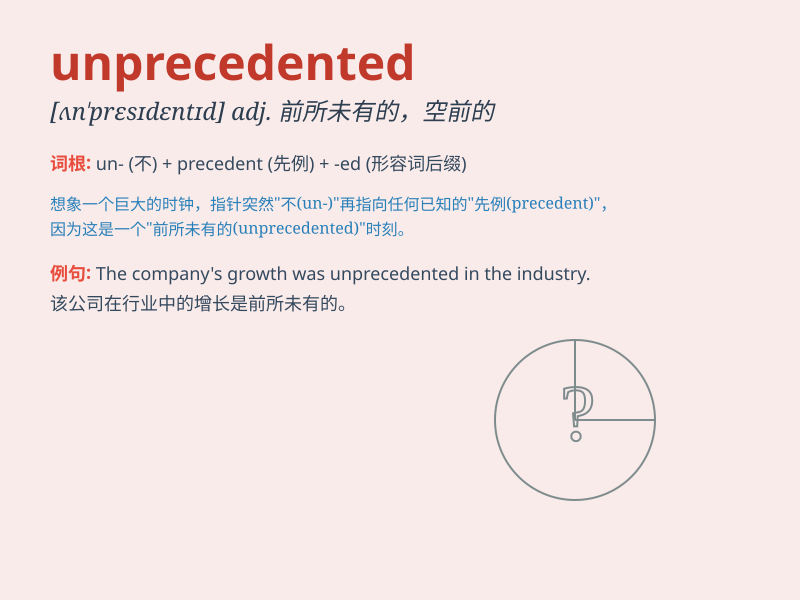

## unprecedented

**英音:** _[ʌn\'presɪdentɪd]_ **美音:**
_[ʌn\'prɛsɪdɛntɪd]_

**译义:** *adj.空前的*

### 短语

+ **unprecedented scale:** _前所未有的规模_

+ **unprecedented growth:** _前所未有的增长_

+ **unprecedented challenge:** _前所未有的挑战_

+ **unprecedented opportunity:** _前所未有的机会_

+ **unprecedented level:** _前所未有的水平_

### 例句

#### 例句1

> **The company achieved an unprecedented level of success this
year.**

**中文翻译:** 这家公司今年取得了前所未有的成功水平。

**单词释义:** 前所未有的

#### 例句2

> **The storm caused unprecedented damage to the coastal areas.**

**中文翻译:** 这场风暴对沿海地区造成了前所未有的破坏。

**单词释义:** 前所未有的

#### 例句3

> **The athlete\'s performance was unprecedented in the history of
the sport.**

**中文翻译:** 这位运动员的表现是该项运动历史上前所未有的。

**单词释义:** 前所未有的

### 背诵小故事

> In a faraway kingdom, there was a year with an
unprecedentedsituation. No rain fell, and crops failed. This was a
situation that had never happened before. People had to find new ways to
survive.

**在一个遥远的王国，有一年出现了前所未有的情况。没有降雨，庄稼歉收。这是以前从未发生过的状况。人们不得不寻找新的生存方法。**

### 图义

