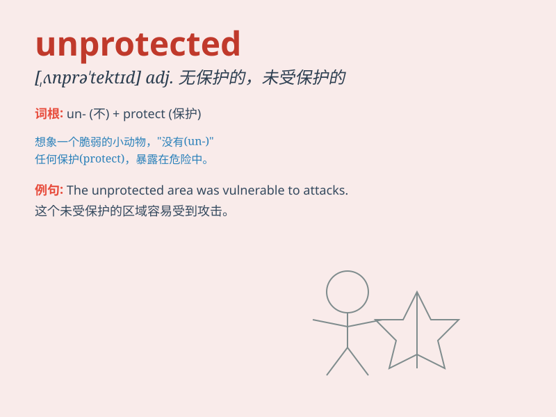

## unprotected

**英音:** _[ˌʌnprəˈtektɪd]_ **美音:** _[ˌʌnprəˈtɛktɪd]_

**译义:** *adj. 无保护的，未受保护的；未设防的*

### 短语

+ **unprotected sex:** _无保护的性行为_

+ **unprotected area:** _未受保护的区域_

+ **unprotected environment:** _未受保护的环境_

+ **unprotected species:** _未受保护的物种_

+ **unprotected coastline:** _未受保护的海岸线_

### 例句

#### 例句1

> **The unprotected coastline is vulnerable to storms.**

**中文翻译:** 未受保护的海岸线容易受到风暴的袭击。

**单词释义:** 未受保护的

#### 例句2

> **Children walking alone on the street are unprotected.**

**中文翻译:** 独自走在街上的孩子是没有保护的。

**单词释义:** 没有保护的

#### 例句3

> **The unprotected computer system is at risk of being hacked.**

**中文翻译:** 未受保护的计算机系统有被黑客攻击的风险。

**单词释义:** 未受保护的

### 背诵小故事

> A little bird was flying in the sky. It was unprotected and had no
shelter from the strong wind. Poor bird! It needed a safe place.
Remember, \'unprotected\' means not having protection.

**一只小鸟在天空中飞翔。它没有受到保护，也没有躲避强风的遮蔽处。可怜的小鸟！它需要一个安全的地方。记住，\'unprotected\'意思是未受保护的。**

### 图义

