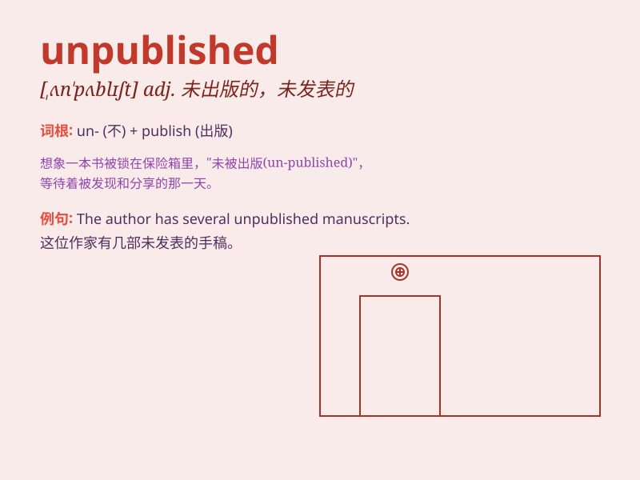

## unpublished

**英音:** _[ʌnˈpʌblɪʃt]_ **美音:** _[ˌʌnˈpʌblɪʃt]_

**译义:** *adj.未出版的；未发表的；未公开的*

### 短语

+ **unpublished manuscript:** _未出版的手稿_

+ **unpublished research:** _未发表的研究_

+ **unpublished work:** _未发表的作品_

+ **unpublished novel:** _未出版的小说_

+ **unpublished poetry:** _未发表的诗歌_

### 例句

#### 例句1

> **The author\'s unpublished manuscript was discovered years after
his death.**

**中文翻译:** 这位作者未出版的手稿在他去世多年后被发现。

**单词释义:** 未出版的

#### 例句2

> **Her unpublished research findings could revolutionize the
field.**

**中文翻译:** 她未发表的研究成果可能会给这个领域带来变革。

**单词释义:** 未发表的

#### 例句3

> **The museum has a collection of unpublished paintings by famous
artists.**

**中文翻译:** 这个博物馆收藏了一些著名艺术家未出版的画作。

**单词释义:** 未出版的

### 背诵小故事

> A writer spent years working on a novel but it remained unpublished.
The reason? It needed more polishing. Finally, after much effort, it got
published and became a bestseller. Remember, \'unpublished\' means not
made public in print.

**一位作家花了数年时间写一部小说，但它一直未出版。原因？它需要更多润色。最终，经过大量努力，它出版了并成为畅销书。记住，\'unpublished\'意思是未出版的。**

### 图义

