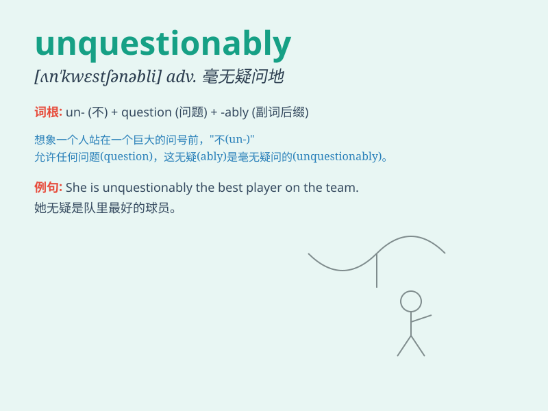

## unquestionably

**英音:** _[ʌn\'kwestʃənəbli]_ **美音:**
_[ʌn\'kwestʃənəbli]_

**译义:** *adv.无疑地,无可非议地*

### 短语

+ **unquestionably true:** _毫无疑问是真实的_

+ **unquestionably correct:** _毫无疑问是正确的_

+ **unquestionably excellent:** _毫无疑问是出色的_

+ **unquestionably important:** _毫无疑问是重要的_

+ **unquestionably successful:** _毫无疑问是成功的_

### 例句

#### 例句1

> **Unquestionably, she is the best candidate for the job.**

**中文翻译:** 毫无疑问，她是这份工作的最佳人选。

**单词释义:** 毫无疑问地

#### 例句2

> **The new law is unquestionably a step in the right direction.**

**中文翻译:** 新法律毫无疑问是朝着正确方向迈出的一步。

**单词释义:** 毫无疑问地

#### 例句3

> **His talent is unquestionably remarkable.**

**中文翻译:** 他的才华毫无疑问是出众的。

**单词释义:** 毫无疑问地

### 背诵小故事

> A brave explorer was lost in a mysterious jungle. Despite facing many
difficulties, his skills and determination were unquestionably
outstanding. Eventually, he found his way out. Here, unquestionably
means undoubtedly or without a doubt.

**一位勇敢的探险家在神秘的丛林中迷路了。尽管面临诸多困难，但他的技能和决心无疑是出色的。最终，他找到了出路。这里，unquestionably
意思是毫无疑问地。**

### 图义

