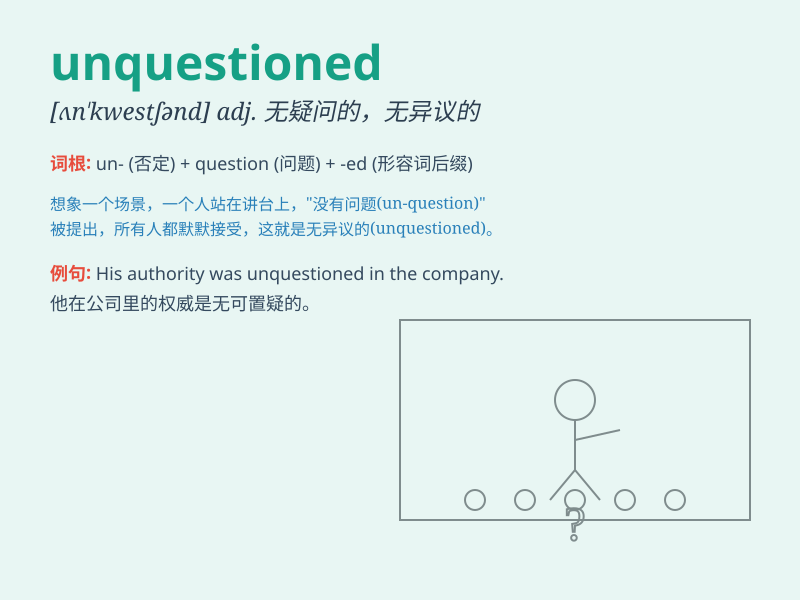

## unquestioned

**英音:** _[ʌn\'kwestʃ(ə)nd]_ **美音:**
_[ʌn\'kwɛstʃənd]_

**译义:** *adj.不成为问题的,无疑问的*

### 短语

+ **unquestioned authority:** _无可置疑的权威_

+ **unquestioned loyalty:** _毫无疑问的忠诚_

+ **unquestioned belief:** _毫无疑问的信念_

+ **unquestioned success:** _毋庸置疑的成功_

+ **unquestioned truth:** _无可争议的真理_

### 例句

#### 例句1

> **His authority in the field remains unquestioned.**

**中文翻译:** 他在这个领域的权威仍然无可置疑。

**单词释义:** 无可置疑的

#### 例句2

> **The value of this antique is unquestioned.**

**中文翻译:** 这件古董的价值是毫无疑问的。

**单词释义:** 毫无疑问的

#### 例句3

> **Her talent as a musician is unquestioned.**

**中文翻译:** 她作为音乐家的才能是毋庸置疑的。

**单词释义:** 毋庸置疑的

### 背诵小故事

> A king\'s authority was unquestioned. Everyone obeyed him without any
doubt. But one brave knight questioned the king\'s unfair rule and
brought changes. Now, \'unquestioned\' means accepted without being
doubted or challenged.

**一位国王的权威是毋庸置疑的。每个人都毫无疑问地服从他。但一位勇敢的骑士质疑了国王不公平的规则并带来了改变。现在，'unquestioned'意思是被毫无怀疑或挑战地接受。**

### 图义

