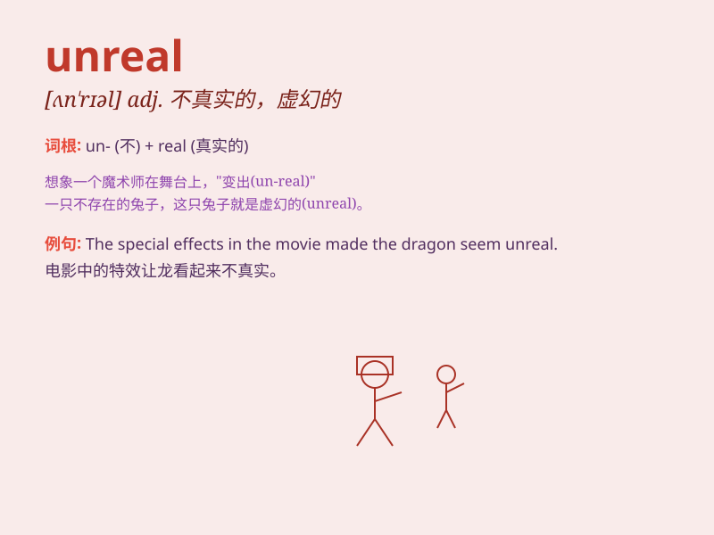

## unreal

**英音:** _[ʌn\'rɪəl]_ **美音:** _[,ʌn\'riəl]_

**译义:** *adj.不真实的,虚幻的*

### 短语

+ **unreal situation:** _不真实的情况_

+ **unreal dream:** _虚幻的梦_

+ **unreal world:** _虚幻的世界_

+ **unreal image:** _不真实的图像_

+ **unreal feeling:** _不真实的感觉_

### 例句

#### 例句1

> **The special effects in the movie were so unreal that it felt like
a dream.**

**中文翻译:** 这部电影中的特效如此不真实，感觉就像一场梦。

**单词释义:** 不真实的；虚幻的

#### 例句2

> **The situation seemed unreal to him, as if he were in a
nightmare.**

**中文翻译:** 这种情况对他来说似乎不真实，好像他在做噩梦。

**单词释义:** 不真实的；梦幻般的

#### 例句3

> **The beauty of the place was almost unreal, beyond what he could
have imagined.**

**中文翻译:** 这个地方的美丽几乎是不真实的，超出了他的想象。

**单词释义:** 难以置信的；奇异的

### 背诵小故事

> In a magical land, there was a city that seemed perfect but was
actually unreal. It had floating castles and talking animals. But when
the sun rose, everything vanished. Just like dreams that seem real but
are unreal.

**在一个神奇的土地上，有一座看似完美实则虚幻的城市。它有漂浮的城堡和会说话的动物。但当太阳升起时，一切都消失了。就像看似真实实则虚幻的梦。**

### 图义

