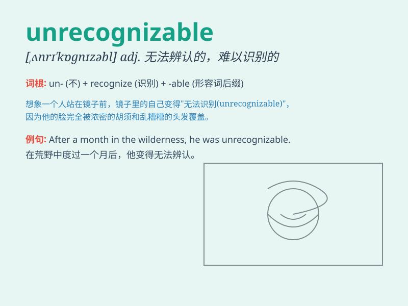

## unrecognizable

**英音:** _[ˌʌnrɛkəɡˈnaɪzəbl]_ **美音:**
_[ˌʌnrɛkəɡˈnaɪzəbl]_

**译义:** *adj.无法辨认的，难以识别的*

### 短语

+ **be unrecognizable:** _变得无法辨认_

+ **become unrecognizable:** _变得难以识别_

+ **remain unrecognizable:** _仍然无法辨认_

+ **make something unrecognizable:** _使某物无法辨认_

+ **turn unrecognizable:** _变得认不出来_

### 例句

#### 例句1

> **The city has become unrecognizable after years of rapid
development.**

**中文翻译:** 这座城市经过多年的快速发展已经变得面目全非。

**单词释义:** 无法辨认的；难以识别的

#### 例句2

> **Her face was so swollen and bruised that it was
unrecognizable.**

**中文翻译:** 她的脸肿得厉害，青一块紫一块，都认不出来了。

**单词释义:** 无法辨认的；难以识别的

#### 例句3

> **The once-familiar neighborhood is now unrecognizable due to new
construction.**

**中文翻译:** 由于新的建设，曾经熟悉的街区现在变得难以辨认。

**单词释义:** 难以识别的；认不出的

### 背诵小故事

> One day, I met an old friend at the mall. But he had changed so much
with a new hairstyle and strange clothes that he was unrecognizable. I
almost passed by without noticing it was him!

**有一天，我在商场遇到一位老朋友。但他变化太大了，新发型和奇怪的衣服让他完全无法辨认。我差点走过都没注意到那是他！**

### 图义

