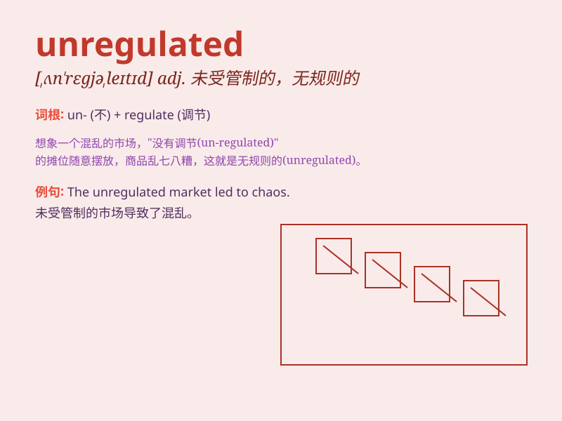

## unregulated

**英音:** _[ˌʌnˈrɛɡjəleɪtɪd]_ **美音:**
_[ˌʌnˈrɛɡjəleɪtɪd]_

**译义:** *adj. 未受管制的；未受调节的；未受监管的*

### 短语

+ **unregulated market:** _不受监管的市场_

+ **unregulated industry:** _未受监管的行业_

+ **unregulated competition:** _无监管的竞争_

+ **unregulated growth:** _不受约束的增长_

+ **unregulated activity:** _未受规范的活动_

### 例句

#### 例句1

> **The unregulated market led to chaos and unfair competition.**

**中文翻译:** 不受监管的市场导致了混乱和不公平竞争。

**单词释义:** 不受监管的

#### 例句2

> **Unregulated fishing has severely damaged the marine
ecosystem.**

**中文翻译:** 不受管制的捕鱼严重破坏了海洋生态系统。

**单词释义:** 不受管制的

#### 例句3

> **The unregulated use of pesticides poses a threat to human
health.**

**中文翻译:** 对农药的无规范使用对人类健康构成威胁。

**单词释义:** 无规范的

### 背诵小故事

> Imagine a wild city where there are no rules or supervision.
Everything is unregulated. People do whatever they want, causing chaos.
This is how you can remember \'unregulated\' - without regulation or
control.

**想象一个狂野的城市，那里没有规则或监管。一切都是不受监管的。人们为所欲为，导致一片混乱。这就是你记住\'unregulated\'------不受监管或控制的方法。**

### 图义

