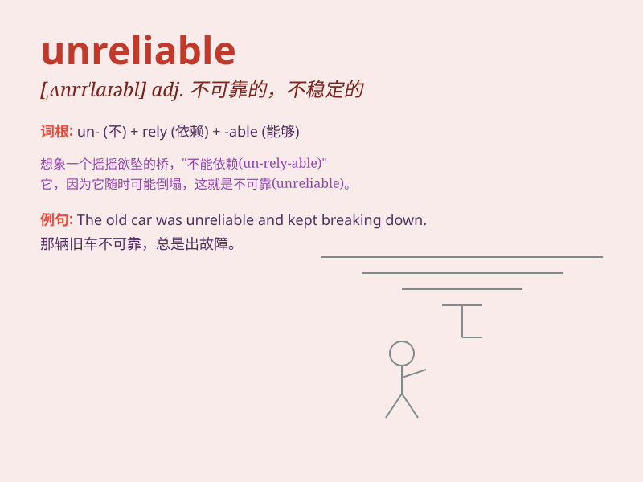

## unreliable

**英音:** _[ʌnrɪ\'laɪəb(ə)l]_ **美音:**
_[,ʌnrɪ\'laɪəbl]_

**译义:** *adj.不可靠的*

### 短语

+ **unreliable evidence:** _不可靠的证据_

+ **unreliable source:** _不可靠的来源_

+ **unreliable narrator:** _不可靠的叙述者_

+ **unreliable information:** _不可靠的信息_

+ **unreliable method:** _不可靠的方法_

### 例句

#### 例句1

> **The car is unreliable and often breaks down.**

**中文翻译:** 这辆车不可靠，经常出故障。

**单词释义:** 不可靠的

#### 例句2

> **He is an unreliable friend who always breaks his promises.**

**中文翻译:** 他是个不可靠的朋友，总是违背承诺。

**单词释义:** 不可靠的

#### 例句3

> **The weather forecast was unreliable; it said it would be sunny
but it rained.**

**中文翻译:** 天气预报不可靠，说晴天结果下雨了。

**单词释义:** 不可靠的

### 背诵小故事

> One day, I needed to catch a train. I asked a man for the time, but
he was unreliable. He gave me the wrong time and I almost missed my
train. Unreliable means not able to be trusted or depended on.

**有一天，我要赶火车。我问一个人时间，但他不可靠。他给了我错误的时间，我差点错过火车。unreliable
意思是不可信赖的；靠不住的。**

### 图义

