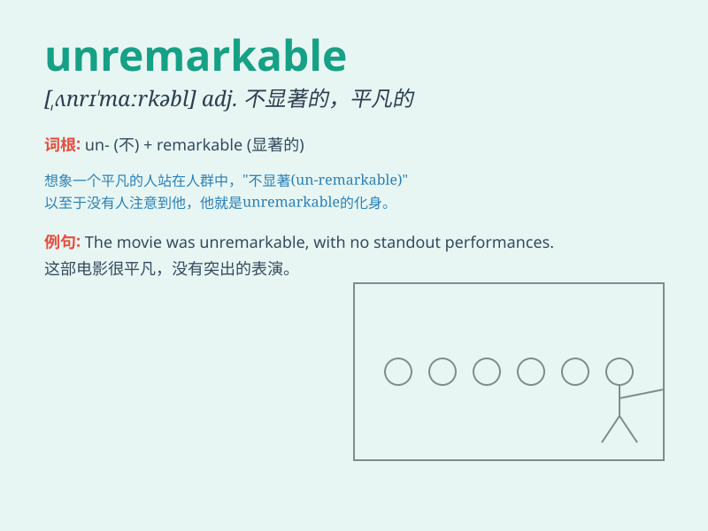

## unremarkable

**英音:** _[ˌʌnrɪˈmɑːkəbl]_ **美音:** _[ˌʌnrɪˈmɑːrkəbl]_

**译义:** *adj.不显著的，平凡的，不值得注意的*

### 短语

+ **unremarkable appearance:** _平凡的外表_

+ **unremarkable performance:** _平淡无奇的表现_

+ **unremarkable life:** _平淡的生活_

+ **unremarkable feature:** _不显著的特征_

+ **unremarkable event:** _不起眼的事件_

### 例句

#### 例句1

> **The view from the window was unremarkable - just a row of houses
and a busy street.**

**中文翻译:**
从窗户看到的景色平淡无奇------只是一排房子和一条繁忙的街道。

**单词释义:** 平凡的；不引人注目的

#### 例句2

> **His performance in the exam was unremarkable; he got average
grades.**

**中文翻译:** 他在考试中的表现平平；他得到了中等的成绩。

**单词释义:** 普通的；一般的

#### 例句3

> **The meal at the restaurant was unremarkable; nothing stood out as
particularly good or bad.**

**中文翻译:**
这家餐厅的饭菜没什么特别的；没有什么特别好或特别坏的地方。

**单词释义:** 平淡的；寻常的

### 背诵小故事

> Once upon a time, there was a plain village. Everything in it was
unremarkable. No special buildings, no famous people. It was just so
ordinary that no one would notice or remember it easily.

**从前，有一个平凡的村庄。村里的一切都平淡无奇。没有特别的建筑，没有出名的人物。它就是如此普通，以至于没人会轻易注意或记住它。**

### 图义

