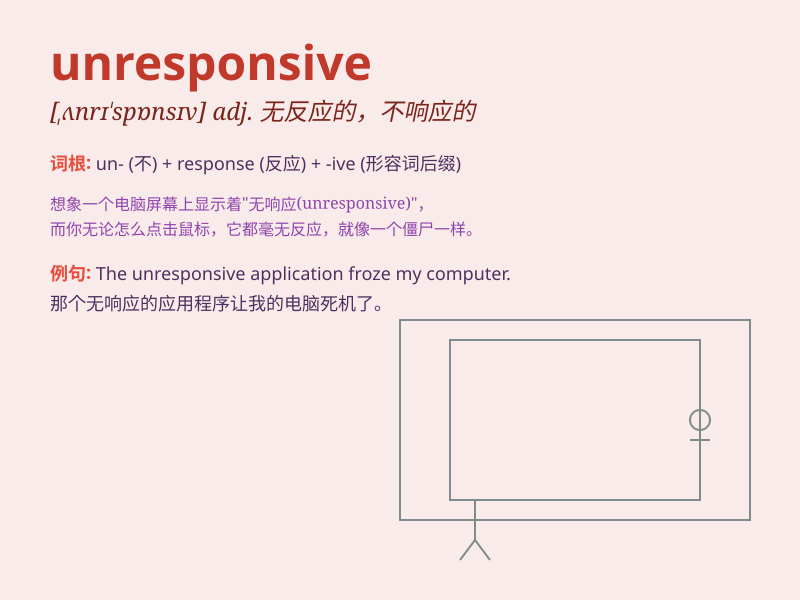

## unresponsive

**英音:** _[ʌnrɪ\'spɒnsɪv]_ **美音:** _[,ʌnrɪ\'spɑnsɪv]_

**译义:** *adj.无答复的,反应迟钝的,感受性迟钝的,无同情心的*

### 短语

+ **be unresponsive to:** _对\...\...无反应；对\...\...没有回应_

+ **remain unresponsive:** _保持无反应；持续没有回应_

+ **unresponsive behavior:** _无反应的行为_

+ **unresponsive system:** _无响应的系统_

+ **seem unresponsive:** _看起来没有反应_

### 例句

#### 例句1

> **The patient remained unresponsive after the accident.**

**中文翻译:** 事故发生后，病人仍然没有反应。

**单词释义:** 没有反应的

#### 例句2

> **The customer service was unresponsive to my complaints.**

**中文翻译:** 客服对我的投诉没有回应。

**单词释义:** 未作出回应的

#### 例句3

> **The computer system became unresponsive, causing a delay in our
work.**

**中文翻译:** 计算机系统变得没有响应，导致我们的工作延误。

**单词释义:** 无响应的

### 背诵小故事

> A man was found lying unconscious on the street. People called for
help, but he remained unresponsive. No matter how loudly they shouted or
shook him, he showed no reaction. Finally, an ambulance arrived.

**一个男人被发现昏迷地躺在街上。人们呼喊求助，但他毫无反应。无论他们喊得多大声，摇晃他多用力，他都没有回应。最后，救护车来了。**

### 图义

