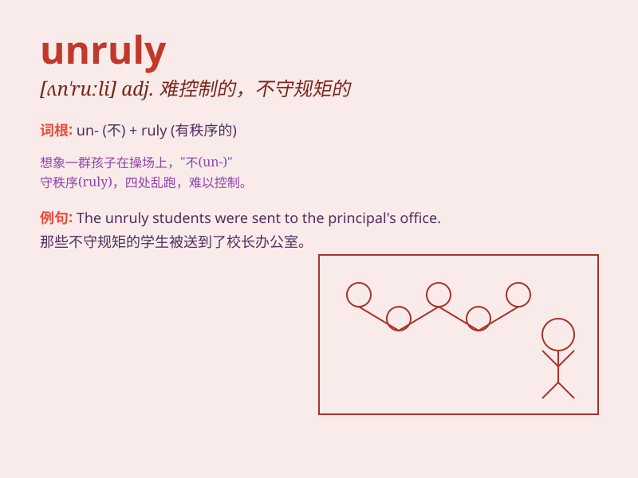

## unruly

**英音:** _[ʌn\'ruːlɪ]_ **美音:** _[ʌn\'ruli]_

**译义:** *adj.不受拘束的,不守规矩的,蛮横的,难驾驭的*

### 短语

+ **unruly behavior:** _不守规矩的行为_

+ **unruly crowd:** _难以控制的人群_

+ **unruly hair:** _乱蓬蓬的头发_

+ **unruly children:** _不守规矩的孩子_

+ **unruly passions:** _难以抑制的激情_

### 例句

#### 例句1

> **The unruly children were causing chaos in the classroom.**

**中文翻译:** 这些不守规矩的孩子在教室里制造混乱。

**单词释义:** 不守规矩的

#### 例句2

> **The unruly crowd became difficult to control.**

**中文翻译:** 这群难以控制的人群变得难以掌控。

**单词释义:** 难以控制的

#### 例句3

> **Her unruly hair needed to be styled properly.**

**中文翻译:** 她那蓬乱的头发需要好好打理一下。

**单词释义:** 蓬乱的

### 背诵小故事

> Once upon a time, there was an unruly child who never listened to his
parents. He always ran wild and caused trouble everywhere. His behavior
was so unruly that no one could control him.

**从前，有一个不守规矩的孩子，从不听父母的话。他总是到处乱跑，惹是生非。他的行为非常任性，没人能管得住他。**

### 图义

