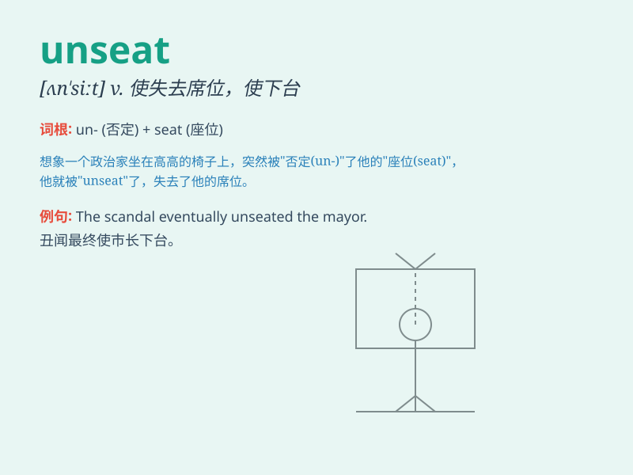

## unseat

**英音:** _[ʌn\'siːt]_ **美音:** _[,ʌn\'sit]_

**译义:** *vt.使从马上摔下,使失去资格*

### 短语

+ **unseat a rider:** _使骑手落马_

+ **unseat a leader:** _使领导人下台_

+ **unseat an MP:** _使议员失去席位_

+ **unseat from power:** _从权力地位上推翻_

+ **unseat by a landslide:** _因压倒性优势而被赶下台_

### 例句

#### 例句1

> **The scandal could unseat the politician from his position.**

**中文翻译:** 这一丑闻可能会使这位政客失去职位。

**单词释义:** 使失去职位

#### 例句2

> **The strong opponent managed to unseat the defending champion.**

**中文翻译:** 强劲的对手设法把卫冕冠军拉下马。

**单词释义:** 把\...拉下马

#### 例句3

> **The new technology has the potential to unseat established
companies in the industry.**

**中文翻译:** 这项新技术有可能使该行业的老牌公司失去地位。

**单词释义:** 使失去地位

### 背诵小故事

> In a wild horse race, the champion rider was unexpectedly unseated.
The powerful horse threw him off, meaning to remove him from the saddle.
\'Unseat\' means to force someone to leave a position, especially one of
power or authority.

**在一场激烈的赛马中，冠军骑手意外落马。那匹强壮的马把他甩了下来，这就意味着让他离开了马鞍。'unseat'意思是迫使某人离开某个职位，尤其是权力或权威的职位。**

### 图义

