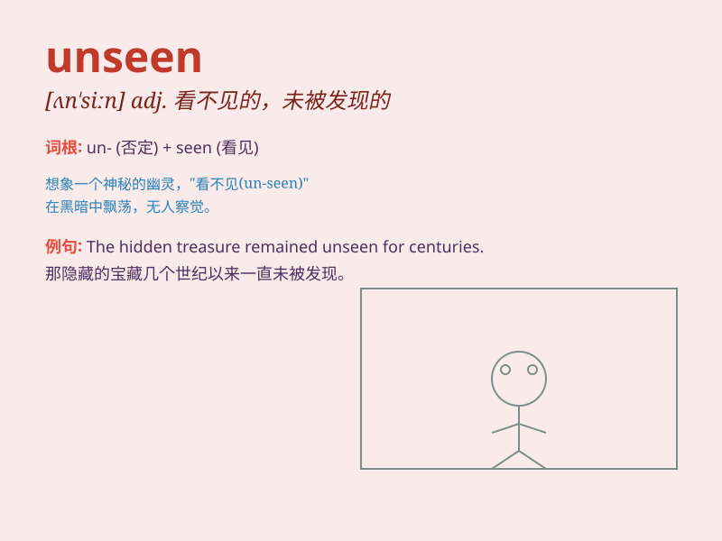

## unseen

**英音:** _[ʌn\'siːn]_ **美音:** _[,ʌn\'sin]_

**译义:** *adj.未见过的,看不见的,未经预习的*

### 短语

+ **unseen danger:** _未被察觉的危险_

+ **unseen force:** _看不见的力量_

+ **unseen guest:** _未露面的客人_

+ **unseen damage:** _未被发现的损害_

+ **unseen opportunity:** _未被发现的机会_

### 例句

#### 例句1

> **The unseen force pulled the object towards the unknown
direction.**

**中文翻译:** 这股看不见的力量把物体拉向了未知的方向。

**单词释义:** 看不见的；未被看见的

#### 例句2

> **She had an unseen talent for painting.**

**中文翻译:** 她有一种未被发现的绘画天赋。

**单词释义:** 未被发现的

#### 例句3

> **The unseen damage to the car was significant.**

**中文翻译:** 汽车未被察觉的损坏很严重。

**单词释义:** 未被察觉的

### 背诵小故事

> One day, Tom was exploring an old house. In a dark corner, he found a
box labeled \'unseen treasures\'. When he opened it, he discovered rare
coins and jewels that no one had ever seen before.

**一天，汤姆在探索一座老房子。在一个黑暗的角落，他发现了一个标有"未见过的宝藏"的盒子。当他打开它时，他发现了以前从未有人见过的稀有硬币和珠宝。**

### 图义

