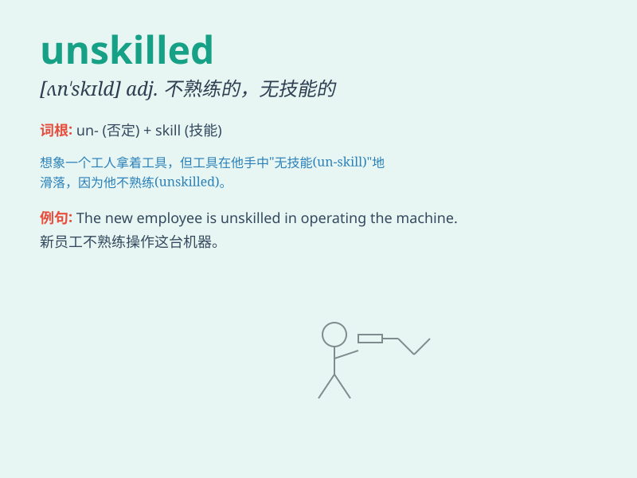

## unskilled

**英音:** _[ʌn\'skɪld]_ **美音:** _[,ʌn\'skɪld]_

**译义:** *adj.不熟练的,拙劣的,无需技能的*

### 短语

+ **unskilled worker:** _非熟练工人_

+ **unskilled labor:** _非熟练劳动力_

+ **unskilled job:** _非技术性工作_

+ **unskilled operation:** _非熟练操作_

+ **unskilled performance:** _不熟练的表现_

### 例句

#### 例句1

> **The factory employs a large number of unskilled workers.**

**中文翻译:** 这家工厂雇用了大量非技术工人。

**单词释义:** 非技术的；无技能的

#### 例句2

> **Unskilled labor is often paid less than skilled labor.**

**中文翻译:** 非熟练劳动力的报酬往往低于熟练劳动力。

**单词释义:** 无技能的；未熟练的

#### 例句3

> **The work is simple enough for an unskilled person to do.**

**中文翻译:** 这项工作足够简单，一个无技能的人也能做。

**单词释义:** 未经训练的；不熟练的

### 背诵小故事

> Once upon a time, there was a worker named Tom. He was unskilled and
struggled to complete tasks. But he was determined to learn and finally
became skilled. Unskilled means lacking the necessary skills or
training.

**从前，有个叫汤姆的工人。他没有技能，完成任务很吃力。但他决心学习，最终变得有技能。unskilled
意思是缺乏必要的技能或训练。**

### 图义

