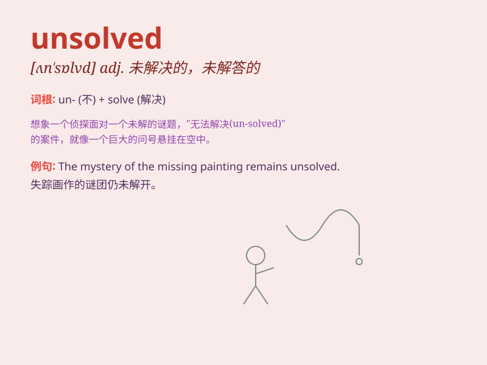

## unsolved

**英音:** _[ʌn\'sɒlvd]_ **美音:** _[,ʌn\'sɑlvd]_

**译义:** *adj.未解答的,未解决的*

### 短语

+ **unsolved mystery:** _未解决的谜团_

+ **unsolved problem:** _未解决的问题_

+ **unsolved case:** _未解决的案件_

+ **remain unsolved:** _仍然未解决_

+ **unsolved crime:** _未破获的罪行_

### 例句

#### 例句1

> **The mystery remains unsolved despite years of investigation.**

**中文翻译:** 尽管经过多年的调查，这个谜团仍然未被解开。

**单词释义:** 未解决的

#### 例句2

> **There are still many unsolved problems in the field of
science.**

**中文翻译:** 在科学领域仍然有许多未解决的问题。

**单词释义:** 未解决的

#### 例句3

> **The unsolved case has haunted the detective for months.**

**中文翻译:** 这个未解决的案子已经困扰了这位侦探好几个月。

**单词释义:** 未解决的

### 背诵小故事

> A detective was faced with an unsolved mystery. A precious gem
disappeared without a trace. Despite his efforts, the case remained
unsolved. It frustrated him greatly, as he was determined to find the
solution.

**一位侦探面临着一个未解决的谜团。一颗珍贵的宝石消失得无影无踪。尽管他努力了，但这个案子仍然未解决。这让他非常沮丧，因为他决心找到解决办法。**

### 图义

