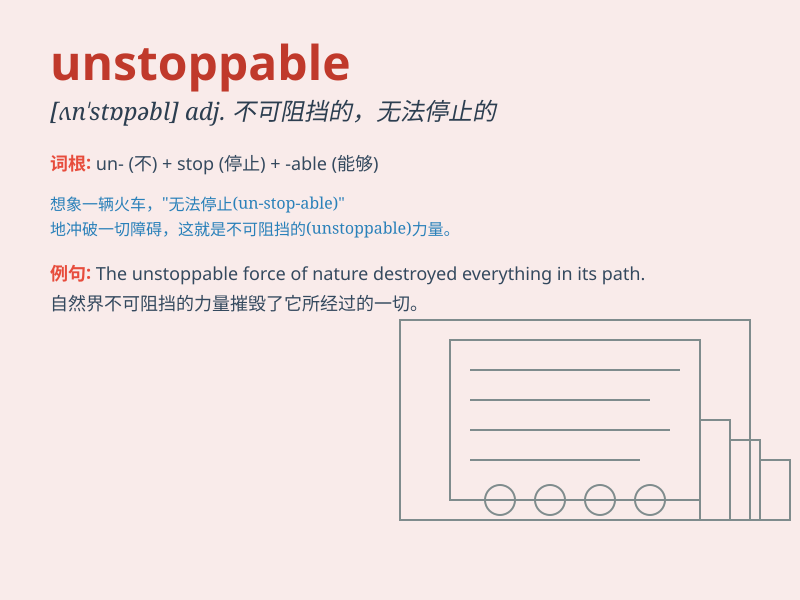

## unstoppable

**英音:** _[ʌnˈstɒpəbl]_ **美音:** _[ʌnˈstɑːpəbl]_

**译义:** *adj. 不可阻挡的；无法停止的；势不可挡的*

### 短语

+ **be unstoppable:** _是不可阻挡的_

+ **become unstoppable:** _变得不可阻挡_

+ **seem unstoppable:** _看起来不可阻挡_

+ **remain unstoppable:** _保持不可阻挡_

+ **an unstoppable force:** _一股不可阻挡的力量_

### 例句

#### 例句1

> **The athlete\'s determination made him unstoppable on the
field.**

**中文翻译:** 这位运动员的决心使他在赛场上势不可挡。

**单词释义:** 不可阻挡的；无法停止的

#### 例句2

> **The technological progress is unstoppable and is changing our
lives rapidly.**

**中文翻译:** 技术进步是不可阻挡的，并且正在迅速改变我们的生活。

**单词释义:** 无法遏制的；不可阻挡的

#### 例句3

> **Her enthusiasm for music is unstoppable; she practices every
day.**

**中文翻译:** 她对音乐的热情是不可阻挡的；她每天都练习。

**单词释义:** 无法停止的；遏制不住的

### 背诵小故事

> A brave warrior was on a mission. No matter how many enemies came, he
kept fighting. His determination was unstoppable. Just like a speeding
train that nothing could stop.

**一位勇敢的战士在执行任务。无论有多少敌人来袭，他都持续战斗。他的决心不可阻挡。就像一列飞驰的火车，没有什么能让其停下。**

### 图义

