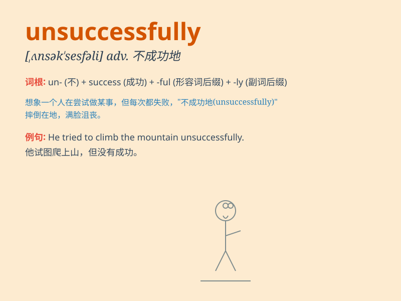

## unsuccessfully

**英音:** _[ˌʌnsək\'sesfli]_ **美音:**
_[ˌʌnsək\'sesfli]_

**译义:** *adv.失败地,无用*

### 短语

+ **attempt unsuccessfully:** _尝试失败_

+ **operate unsuccessfully:** _操作不成功_

+ **negotiate unsuccessfully:** _谈判失败_

+ **compete unsuccessfully:** _竞争失败_

+ **perform unsuccessfully:** _表现不佳_

### 例句

#### 例句1

> **He tried to fix the car unsuccessfully.**

**中文翻译:** 他试图修理汽车，但没有成功。

**单词释义:** 没有成功地

#### 例句2

> **The athlete competed unsuccessfully in the championship.**

**中文翻译:** 这位运动员在锦标赛中比赛失利。

**单词释义:** 不成功地

#### 例句3

> **She applied for the job unsuccessfully several times.**

**中文翻译:** 她申请这份工作好几次都未成功。

**单词释义:** 未成功地

### 背诵小故事

> A brave adventurer tried to find the hidden treasure unsuccessfully.
He followed many clues and faced many difficulties, but in the end, he
still couldn\'t get the treasure. Poor guy!

**一位勇敢的冒险家试图寻找隐藏的宝藏，但未成功。他遵循了许多线索，面临了诸多困难，但最终，他还是没能得到宝藏。可怜的家伙！**

### 图义

