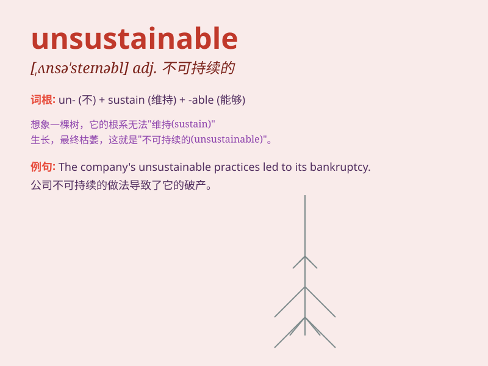

## unsustainable

**英音:** _[ˌʌnsəˈsteɪnəbl]_ **美音:**
_[ˌʌnsəˈsteɪnəbl]_

**译义:** *adj.不可持续的；无法维持的；不能成立的*

### 短语

+ **unsustainable development:** _不可持续的发展_

+ **unsustainable growth:** _不可持续的增长_

+ **unsustainable consumption:** _不可持续的消费_

+ **unsustainable practices:** _不可持续的做法_

+ **unsustainable agriculture:** _不可持续的农业_

### 例句

#### 例句1

> **The current economic model is unsustainable in the long term.**

**中文翻译:** 当前的经济模式从长远来看是不可持续的。

**单词释义:** 不可持续的

#### 例句2

> **This level of resource consumption is unsustainable for our
planet.**

**中文翻译:** 这种资源消耗水平对我们的星球来说是不可持续的。

**单词释义:** 不可持续的

#### 例句3

> **The company\'s rapid expansion proved to be unsustainable and led
to financial difficulties.**

**中文翻译:** 公司的快速扩张被证明是不可持续的，并导致了财务困难。

**单词释义:** 不可持续的

### 背诵小故事

> A city was growing too fast. It used up all resources. The way it
developed was unsustainable. People finally realized they needed to
change to make it last.

**一个城市发展得太快了。它耗尽了所有资源。它的这种发展方式是不可持续的。人们最终意识到他们需要改变才能让其长久。**

### 图义

